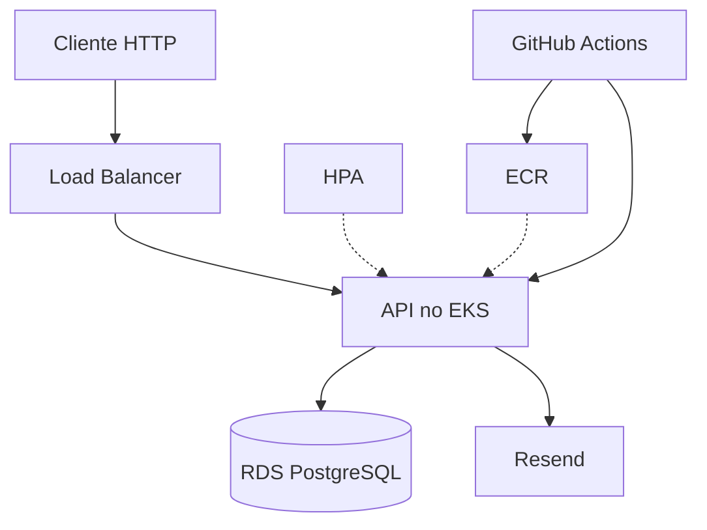

# Oficina Mecânica API

API para gestão de oficina mecânica: clientes, veículos, ordens de serviço (workflow com status), serviços, estoque, notificações por e-mail e autenticação.

Stack: [NestJS](https://nestjs.com/) · TypeORM · PostgreSQL · JWT · Resend · Docker · Kubernetes · Terraform

## Objetivos

- Organizar o código com **Clean Architecture / Hexagonal** (camadas e ports/adapters).
- Garantir qualidade com **testes automatizados** e **CI/CD**.
- Rodar a aplicação de forma **containerizada**, com **Kubernetes** (inclui HPA) e **infra como código** (Terraform na AWS).
- Preparar o sistema para maior demanda com escala automática dos pods.

## Entrega

Links da entrega (repositório, vídeo, Swagger, prints, documentação):

**→ [docs/entrega/README.md](./docs/entrega/README.md)**

---

## Desenho da arquitetura

### Componentes da aplicação

Monólito modular NestJS: cada contexto (`clientes`, `veiculos`, `servicos`, `estoque`, `ordens-de-servico`, `notificacoes`, `auth`, `users`) com camadas `domain` → `application` → `infrastructure` → `presentation`, integrados via **ports**.

| Módulo | Responsabilidade |
| ------ | ---------------- |
| **Clientes** | CRUD, busca por documento (CPF/CNPJ) |
| **Veículos** | CRUD, vínculo com cliente |
| **Serviços** | Catálogo de serviços |
| **Estoque** | Peças/insumos, reposição, saldo |
| **Ordens de serviço** | Abertura, orçamento, aprovação, execução, status, relatórios |
| **Notificações** | E-mail (Resend) em mudanças de status |
| **Usuários / Auth** | CRUD de usuários, login JWT |

Detalhes: **[docs/architecture](./docs/architecture/README.md)**.

### Infraestrutura provisionada



| Recurso | Função |
| ------- | ------ |
| **EKS** + Deployment/Service/HPA | Orquestração e escala por CPU |
| **RDS PostgreSQL** | Banco gerenciado |
| **ECR** | Imagens Docker |
| **VPC / rede** | Terraform em `infra/` |
| **Resend** | E-mails transacionais |
| **GitHub Actions** | Build, testes e deploy |

Diagrama completo: **[docs/deployment](./docs/deployment/README.md)**.

### Fluxo de deploy

1. Terraform (`infra/`) provisiona EKS, RDS, ECR e rede.
2. CI/CD faz build, testes e push da imagem no ECR.
3. Manifestos Kubernetes (`k8s/`) são aplicados no cluster (Deployment, Service, HPA, ConfigMap/Secret).

Detalhes: **[docs/deployment](./docs/deployment/README.md)** · **[CI/CD](./docs/ci-cd/README.md)**.

---

## Instruções

### Execução local

**Pré-requisitos:** Node 20.11+ (ou 22), Docker Compose, arquivo `.env`.

```bash
cp .env.example .env
nvm use && npm install          # se usar nvm
docker compose up -d db
npm run migration:run
npm run start:dev
```

API em `http://localhost:3000` · Swagger em `http://localhost:3000/api`.

Guia completo: **[docs/build](./docs/build/README.md)**.

### Provisionamento com Terraform

```bash
cd infra
cp .env.example .env   # ajuste senhas, JWT, CIDRs
source .env
terraform init
terraform apply
```

Passo a passo: **[docs/deployment/infra.md](./docs/deployment/infra.md)**.

### Deploy em Kubernetes

Após a infra e a imagem no ECR:

```bash
source infra/.env
source infra/load-terraform-outputs.sh
source infra/load-k8s-template-vars.sh
bash infra/prepare-k8s-overlay.sh
bash infra/render-k8s-overlay.sh
bash infra/apply-k8s-overlay.sh
```

Guia: **[docs/deployment/k8s.md](./docs/deployment/k8s.md)** (EKS e Minikube).

---

## Collection das APIs (Swagger)

- **Local:** http://localhost:3000/api  
- Rotas protegidas: Bearer JWT (botão **Authorize** no Swagger).

Login rápido:

```bash
curl -X POST http://localhost:3000/api/v1/auth/login \
  -H "Content-Type: application/json" \
  -d '{"email": "admin@oficina.com", "password": "admin123"}'
```

---

## Notificações por e-mail (Resend)

Mudanças de status da OS disparam e-mails via [Resend](https://resend.com). Configure `RESEND_API_KEY`, `RESEND_FROM`, `NOTIFICACAO_EMAIL_MECANICOS` e `NOTIFICACAO_EMAIL_ADMIN` no `.env`.

Guia: **[docs/build — E-mail](./docs/build/README.md#e-mail-resend)** · [ADR 002](./docs/adr/002-envio-de-email-com-resend.md).

---

## Documentação

| Documento | Conteúdo |
| --------- | -------- |
| **[Entrega](./docs/entrega/README.md)** | Links da entrega (repo, vídeo, Swagger, docs) |
| [Arquitetura](./docs/architecture/README.md) | Clean/Hexagonal, ports, módulos |
| [Deploy](./docs/deployment/README.md) | Desenho de infra AWS + fluxo de deploy |
| [Terraform](./docs/deployment/infra.md) | Provisionamento AWS |
| [Kubernetes](./docs/deployment/k8s.md) | EKS e Minikube (manifestos, HPA, carga) |
| [CI/CD](./docs/ci-cd/README.md) | GitHub Actions |
| [Build local](./docs/build/README.md) | npm, Docker Compose, migrations, testes |
| [ADRs](./docs/adr/README.md) | Decisões arquiteturais |
| [Análises](./docs/analysis/README.md) | SonarQube, OWASP ZAP |
