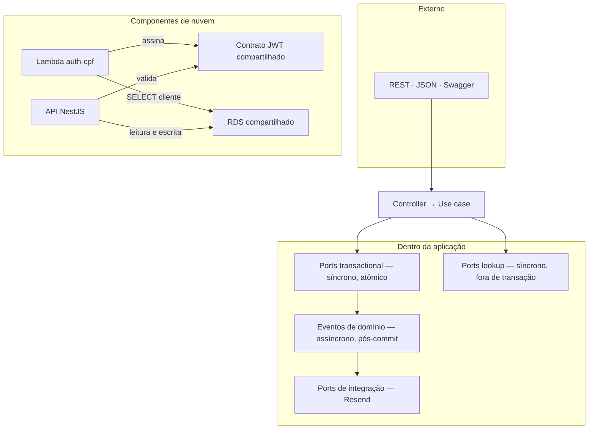

# ADR 004 — Padrão de comunicação entre componentes

| Campo  | Valor      |
| ------ | ---------- |
| Data   | 06/09/2026 |
| Status | Aceita     |
| Decisores | Grupo 32SOAT: Allan Kayan Gadioli Alves, Gustavo de Matos Parizi, Isaac Bruno Siqueira de Souza, João Ricardo Bianchini Vieira, Juliana Silveira Amorim do Nascimento |

## 📌 Contexto

A plataforma tem comunicação em três escalas diferentes, e tratá-las com o mesmo mecanismo seria errado nas três.

**Entre sistemas externos e a plataforma.** Clientes e equipe da oficina consomem a API por HTTP. Há um Swagger publicado e um front-end previsto.

**Entre os componentes de nuvem.** Existem duas unidades de execução independentes: a Lambda de autenticação e a API no EKS. Elas não compartilham processo, mas compartilham o mesmo banco e o mesmo contrato de JWT.

**Dentro da aplicação.** O monólito modular NestJS tem contextos separados (`clientes`, `veiculos`, `servicos`, `estoque`, `ordens-de-servico`, `notificacoes`, `auth`, `users`) que precisam se cruzar. Abrir uma OS toca cinco deles. Se os casos de uso importassem repositórios uns dos outros, a fronteira entre contextos existiria só na estrutura de pastas.

Havia ainda um problema de acoplamento temporal. Ao abrir uma OS, três coisas precisam acontecer: gravar a ordem, registrar o histórico e notificar por e-mail. As duas últimas não podem fazer o cliente HTTP esperar por uma chamada ao provedor de e-mail, nem derrubar a criação da ordem se o Resend estiver fora do ar.

A pergunta desta ADR é: **qual padrão de comunicação usar em cada escala, e onde ficam as fronteiras**.

## ✅ Decisão

Adotamos **três padrões distintos**, um por escala, com regras explícitas de quando cada um se aplica.

### 1. Externo — REST síncrono sobre HTTP

API REST em NestJS, versionada em `/api/v1`, documentada em Swagger, com JSON nos dois sentidos.

Ponto de entrada único: API Gateway HTTP API. `POST /auth/cpf` vai para a Lambda; `ANY /{proxy+}` faz proxy HTTP para o NLB da API. Não cadastramos rota por endpoint.

Não adotamos GraphQL nem gRPC. O consumidor é um front administrativo e um portal de cliente, ambos com necessidades de dados previsíveis, e o Swagger é entregável exigido.

### 2. Entre componentes de nuvem — contrato compartilhado, sem chamada direta

A Lambda **não chama** a API Nest, e a API **não invoca** a Lambda. As duas se comunicam por dois contratos compartilhados:

| Contrato | Forma |
| -------- | ----- |
| Identidade | JWT HS256 com `JWT_SECRET` comum. A Lambda assina, o Nest valida |
| Dados | Ambas leem a tabela `cliente` no mesmo RDS |

A Lambda executa uma consulta `SELECT` direta em `cliente`, com pool `pg` limitado a `max: 2`. Não passa pela API.

Isso é acoplamento por banco compartilhado, que normalmente se evita. Foi aceito porque a Lambda tem um único acesso, somente leitura, sobre três colunas, e porque a alternativa (Lambda chamando um endpoint do Nest) criaria dependência de disponibilidade do cluster para autenticar. Registrado como trade-off nas consequências.

### 3. Interno — ports síncronos e eventos assíncronos

Dentro do monólito, a regra é: **use case não importa repositório de outro módulo**. O cruzamento passa por um port declarado pelo módulo consumidor e implementado por um adapter do módulo dono.

Dois padrões síncronos, escolhidos pelo contexto de execução:

| | Lookup | Transactional |
| --- | ------ | ------------- |
| Quando | Leitura auxiliar fora de transação | Coordenação dentro de `runInTransaction` |
| Acesso | Repositório do módulo dono | `EntityManager` compartilhado |
| Exemplos | `ClienteLookupPort`, `VeiculoLookupPort` | `ClienteTransactionalPort`, `VeiculoTransactionalPort` |

E um padrão assíncrono, por eventos de domínio via `EventEmitter2`, para tudo que é **efeito colateral posterior** e não pertence à unidade de consistência da operação. A intenção é que esses eventos rodem depois do commit; a implementação atual os emite dentro do callback transacional, antes do commit (ver consequências).

`OrdemServicoEventsPort` é a fronteira: o use case emite contra o port, e `OrdemServicoEventsAdapter` traduz para o emitter. Onze eventos de domínio existem hoje, incluindo `StatusAlteradoEvent`, `OsCriadaEvent`, `OrcamentoGeradoEvent`, `OrcamentoAprovadoEvent`, `OsFinalizadaEvent` e `AguardandoPecasEvent`.

O critério de corte é este:

| Precisa acontecer atomicamente? | Padrão |
| ------------------------------- | ------ |
| Sim — reserva de estoque, inserção de itens | Port transactional, dentro do `BEGIN`/`COMMIT` |
| Não — histórico, e-mail | Evento de domínio, fora da unidade de consistência |

### 4. Integrações externas — port com adapter

Serviços de terceiros entram por port. `NotificacaoPort` é implementada por `ResendNotificacaoAdapter`. O domínio da OS não conhece Resend.

## 📊 Consequências

### 👍 Positivas

- Fronteira entre contextos é verificável no código, não apenas convenção de pastas. Um `import` de repositório alheio destoa e aparece em revisão.
- A distinção lookup vs transactional torna explícito, na assinatura do port, se a operação participa da unidade ACID. Elimina a classe de bug em que uma leitura fora da transação enxerga estado pré-commit.
- Resposta HTTP da abertura de OS não espera pelo Resend. Indisponibilidade do provedor de e-mail não impede criar ordem.
- Adicionar reação a um evento existente não altera o use case que o emite.
- Trocar o provedor de e-mail é escrever outro adapter, sem tocar em `ordens-de-servico`.
- Lambda autentica mesmo com o cluster indisponível, porque não depende do Nest.

### 👎 Negativas / trade-offs

- Os eventos são emitidos antes do commit. `CreateOrdemServicoUseCase` chama `emitStatusAlterado` e `emitOsCriada` dentro do callback de `runInTransaction`. O listener de histórico grava em outra conexão, então o `INSERT` em `historico_status_os` disputa com o `COMMIT` da OS e pode falhar na FK. Detalhe em [sequencia-abertura-os.md](../architecture/sequencia-abertura-os.md). A correção é emitir depois do `runInTransaction`; está na evolução prevista.
- Eventos não têm garantia de entrega. `EventEmitter2` é in-process. Se o listener de histórico falhar, a OS fica com `status_atual` preenchido e sem linha em `historico_status_os`. Não há retry, dead-letter nem alerta. Esta é a falha silenciosa que o requisito de "alertas para falhas no processamento de ordens de serviço" precisa cobrir.
- Eventos morrem com o pod. Sendo in-process, um evento emitido e não processado antes do término do pod se perde. Mesmo com `RollingUpdate` ([ADR 005](./005-uso-de-hpa.md)), a troca de cada pod é uma janela para isso.
- Banco compartilhado entre Lambda e API. Mudança na tabela `cliente` pode quebrar a Lambda sem que nenhum teste da API acuse. Não há contrato versionado entre os dois repositórios.
- Segredo JWT compartilhado. Detalhado na [ADR 003](./003-auth-cliente-lambda-jwt-role.md).
- Mais indireção. Um cruzamento entre módulos exige port, adapter e wiring no `infra.module.ts`. Custo de escrita maior que um import direto.
- Ports lookup e transactional para a mesma entidade significam duas implementações a manter sincronizadas (`clientes` e `veiculos` expõem os dois).

## 🔀 Alternativas consideradas

| Alternativa | Por que não foi escolhida |
| ----------- | ------------------------- |
| **Import direto entre módulos** | Elimina a indireção, mas dissolve a fronteira entre contextos. A separação viraria apenas organização de pastas, e a migração futura para serviços independentes perderia o ponto de corte |
| **Message broker (SQS, SNS, RabbitMQ)** | Resolveria entrega garantida, retry e dead-letter, que são exatamente as fraquezas do `EventEmitter2`. Não adotado agora porque adiciona infraestrutura, Terraform e operação a um monólito de deploy único, onde emissor e consumidor estão no mesmo processo. **É a evolução natural quando o histórico deixar de ser perda aceitável** |
| **Outbox pattern** | Gravaria os eventos na mesma transação da OS; consistência sem broker. Meio-termo real entre o que temos e SQS. Exige tabela de outbox e um worker de despacho. Candidato mais forte para a próxima fase |
| **Listener síncrono dentro da transação** | Histórico ficaria atômico com a OS, eliminando a inconsistência silenciosa. Mas colocaria a chamada ao Resend dentro do `BEGIN`/`COMMIT`, segurando conexão do pool durante I/O de rede externa. Inaceitável sob carga |
| **gRPC entre Lambda e API** | Contrato tipado e versionado no lugar do banco compartilhado. Exigiria a Lambda depender da disponibilidade do EKS para autenticar, invertendo justamente a propriedade que queríamos |
| **GraphQL na borda** | Flexibilidade de query que os consumidores atuais não pedem. Swagger é entregável exigido; REST atende |
| **Service mesh (Istio, Linkerd)** | Faz sentido com vários serviços no cluster. Há um só. Complexidade sem contrapartida |

## 🔮 Evolução prevista

- Mover a emissão dos eventos para depois do `runInTransaction`, no use case. Correção pequena e imediata.
- Outbox pattern para os eventos de histórico, eliminando a inconsistência silenciosa sem introduzir broker.
- Alerta de observabilidade sobre divergência entre `ordem_servico.status_atual` e a última linha de `historico_status_os`, cobrindo o gap enquanto o outbox não existe ([ADR 006](./006-stack-de-observabilidade.md)).
- Contrato versionado entre Lambda e API quando a tabela `cliente` evoluir, seja por view dedicada ou por endpoint de leitura.
- Broker externo se e quando um segundo consumidor precisar reagir aos eventos da OS.

## 🔗 Relacionados

- [ADR 003 — Auth de cliente via Lambda](./003-auth-cliente-lambda-jwt-role.md)
- [ADR 005 — Uso de HPA](./005-uso-de-hpa.md)
- [Arquitetura da aplicação](../architecture/README.md)
- [Sequência — abertura de OS](../architecture/sequencia-abertura-os.md)
