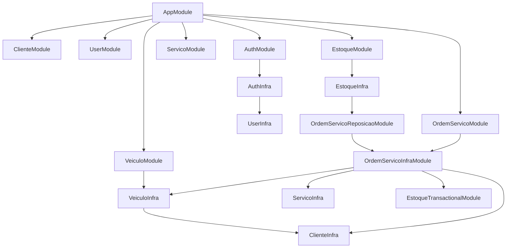

# Arquitetura


Visão da organização do código da **Oficina Mecânica API**: um **monólito modular** em NestJS, com influência de **Clean/Hexagonal Architecture**. Cada contexto de negócio vive em uma pasta em `src/`, com camadas internas e comunicação entre módulos via **ports** (contratos + token de DI), não via import direto de repositório ou entidade TypeORM de outro módulo.


Stack principal: **NestJS**, **TypeORM**, **PostgreSQL**.


---


## Visão geral de `src/`


```

src/

├── app.module.ts          # composição raiz Nest

├── main.ts                # bootstrap (configureApp, Swagger)

│

├── common/                # transversal (sem regra de negócio)

├── config/                # variáveis de ambiente + validação Joi

├── database/              # TypeORM root, migrations, seeds

├── health/                # health check

│

├── auth/                  # autenticação (JWT, login, troca de senha)

├── users/                 # CRUD de usuários + credenciais

├── clientes/

├── veiculos/

├── servicos/

├── estoque/

└── ordens-de-servico/     # núcleo do workflow + relatórios

```


**Estilo adotado:** bounded contexts separados por pasta, cada um com `module.ts` Nest. Não é microserviço — é um deploy único com fronteiras claras.


---


## Padrão interno de cada módulo de negócio


Quase todos os contextos seguem o mesmo recorte:


```

{modulo}/

├── module.ts                    # Nest: imports infra + controllers + use cases

│

├── domain/                      # regras puras, entidades, VOs, erros

│   └── value-objects/           # (quando faz sentido)

│

├── application/

│   ├── dto/                     # inputs da aplicação (+ re-exports legados)

│   ├── read-models/             # (ordens-de-servico) projeções de query tipadas

│   ├── ports/                   # contratos (repository, transactional, lookup…)

│   ├── use-cases/               # orquestração

│   └── validators/              # (ordens-de-servico)

│

├── infrastructure/

│   ├── infra.module.ts          # wiring TypeORM + adapters + exports de ports

│   ├── typeorm/

│   │   ├── entity/

│   │   └── repository/

│   ├── mappers/                 # (ordens-de-servico) entity → read model

│   ├── transactional/           # leitura dentro de EntityManager (cross-módulo)

│   ├── lookup/                  # leitura cross-módulo fora de transação (clientes, veículos)

│   ├── credential/              # (users — senha para auth)

│   ├── adapters/                # implementa ports definidos por outros módulos

│   ├── persistence/             # (OS — transação multi-agregado)

│   ├── events/                  # (OS — event emitter + listeners)

│   └── helpers/                 # (OS — loader de read model; estoque — mutação de domínio)

│

└── presentation/

    ├── controllers/

    ├── dto/                     # DTOs HTTP (class-validator, Swagger)

    ├── mappers/                 # HTTP request → application input

    └── guards/                  # (auth)

```


### Responsabilidade de cada camada


| Camada | Papel |

| ------ | ----- |

| **presentation** | HTTP: controllers, validação de request, Swagger, **mapeamento de resposta** |

| **application** | casos de uso; depende de **ports**, não de TypeORM; retorna **domínio** ou **read model** |

| **domain** | regra de negócio sem Nest/TypeORM |

| **infrastructure** | TypeORM, bcrypt/JWT, listeners, adapters, **entity → read model** |

| **module.ts** | cola Nest: `imports`, `controllers`, `providers` |


Fluxo típico de uma request:


```

HTTP → Controller → UseCase → Port → Adapter/Repository → DB

                ↑                              ↓

              Domain                    ReadModel (queries)

                ↑

Presentation: ResponseDto.fromDomain() | fromReadModel()

```


---


## Contrato de retorno e mapeamento HTTP


A **application não mapeia para DTO de resposta**. Controllers delegam o mapeamento à presentation.


| Módulo | Use case retorna | Presentation mapeia com |

| ------ | ---------------- | ----------------------- |

| clientes, users, servicos, estoque, veículos | entidade de **domain** | `*ResponseDto.fromDomain()` |

| ordens-de-servico (queries/comandos) | **read model** tipado | `OrdemServicoResponseDto.fromReadModel()` |

| ordens-de-servico (histórico) | `HistoricoStatusReadModel` | `HistoricoStatusResponseDto.fromReadModel()` |

| ordens-de-servico (consulta pública) | read model + histórico | `StatusPublicoResponse.fromReadModel()` |

| auth | `LoginReadModel` | `LoginResponseDto.fromReadModel()` |

| health | `HealthReadModel` | `HealthResponseDto.fromReadModel()` |

| relatórios (tempo médio) | `TempoMedioReadModel` | `TempoMedioResponseDto.fromReadModel()` |


**Por que read model na OS?** Ordens de serviço cruzam bounded contexts (cliente, veículo, estoque, serviço) com joins de leitura. Um agregado `OrdemServico` completo acoplaria domínios distintos. O padrão adotado é **CQRS light**: writes via `OsWorkflowHandle` + transação; reads via `OrdemServicoReadModel` em `application/read-models/`, mapeado explicitamente em `OrdemServicoReadModelMapper` (infra).


**Presentation mappers** (`*-presentation.mapper.ts`) convertem apenas **request DTO → application input**, nunca resposta.


### Exceções e HTTP


A **application e a infra** lançam erros de aplicação (`NotFoundError`, `BadRequestError`, `ConflictError`, `UnauthorizedError`) ou erros de domínio conhecidos (`TransicaoInvalidaError`, `EstoqueOperacaoInvalidaError`, etc.) — **sem** importar `HttpException` do Nest.


O **`ApplicationExceptionFilter`** (`common/presentation/filters/`) traduz erros de aplicação e de domínio conhecidos para JSON HTTP. Exceções Nest (`HttpException` do `ValidationPipe`) também passam pelo filter. Auth (`ValidateCredentialsUseCase`, `ChangePasswordUseCase`, `JwtAuthGuard`) usa `UnauthorizedError` — controllers não traduzem erro manualmente. Erros não mapeados retornam **500** genérico.


---


## Revisão arquitetural (estado atual)


Pontos verificados na última revisão do código:


| Área | Status |

| ---- | ------ |

| Mapeamento HTTP só na presentation | OK — CRUDs com `fromDomain()`, OS/auth/health/relatório com `fromReadModel()` |

| Exceções desacopladas do Nest na application/infra | OK — `ApplicationError` + filter global |

| Domínio da OS fora da entidade TypeORM | OK — regras em `domain/ordem-servico.ts`, mutação via `OsTypeormHandle` |

| Read models tipados (OS) | OK — sem `Record<string, unknown>` nem casts inseguros no mapper |

| Ports cross-módulo (lookup / transactional / reposição) | OK |

| POST `/users` sem senha | **Pendente** — usuário criado via API não autentica |

| CI (GitHub Actions) | **Ausente** |

| Notificações de OS | **Mock** — `NotificarListener` só registra log |

| Código legado em application | **Resolvido** — aliases `*Output` e mappers obsoletos removidos |

| Comportamento de domínio em `EstoqueTypeormEntity` | **Resolvido** — mutações via `applyEstoqueDomainMutation` no adapter transacional |

| Nomenclatura entidades TypeORM | **Resolvido** — `*TypeormEntity` único; aliases `@deprecated` removidos |


---


## Módulos transversais


### `common/`


```

common/

├── application/errors/   # ApplicationError, NotFoundError, BadRequestError, …

├── bootstrap/       # configureApp, configureSwagger

├── core/            # CoreModule (interceptor global)

├── decorators/      # Swagger, validações customizadas

├── interceptors/    # TransformResponseInterceptor

├── pagination/      # DTO + util compartilhados

├── presentation/filters/  # ApplicationExceptionFilter

└── security/        # password-hash.ts (rounds + hash/compare centralizados)

```


### `config/`


Variáveis de ambiente validadas (app, database, jwt).


### `database/`


```

database/

├── database.module.ts    # TypeOrmModule.forRoot + registro de entidades

├── data-source.ts        # CLI de migrations

├── migrations/

└── seeds/                # SeedingModule (habilitado só em dev/test)

```


Centraliza o registro de entidades de todos os módulos — acoplamento estrutural natural de um monólito TypeORM.


---


## Wiring Nest (dois níveis por contexto)


| Arquivo | Função |

| ------- | ------ |

| `{modulo}/module.ts` | API: controllers + use cases |

| `{modulo}/infrastructure/infra.module.ts` | persistência + adapters + exports de ports |


**Submódulos especiais:**


| Arquivo | Função |

| ------- | ------ |

| `ordens-de-servico/reposicao.module.ts` | expõe `ORDEM_SERVICO_REPOSICAO_PORT` para o estoque |

| `estoque/infrastructure/estoque-transactional.module.ts` | expõe `ESTOQUE_TRANSACTIONAL_PORT` para a OS |


### Grafo de dependências entre módulos





---


## Ports cross-módulo


Fronteiras entre contextos. Use cases **não** importam infraestrutura alheia diretamente.


| Port | Onde está definido | Quem consome | Finalidade |

| ---- | ------------------ | ------------ | ---------- |

| `USER_CREDENTIAL_PORT` | users | auth | login e troca de senha |

| `CLIENTE_LOOKUP_PORT` | clientes | veículos | documento → `clienteId` (fora de transação) |

| `CLIENTE_TRANSACTIONAL_PORT` | clientes | OS (write) | cliente dentro do `EntityManager` da transação |

| `VEICULO_LOOKUP_PORT` | veículos | OS (query) | snapshot de veículo (incl. soft-deleted) fora de transação |

| `VEICULO_TRANSACTIONAL_PORT` | veículos | OS (write) | placa + cliente → `veiculoId` na transação |

| `SERVICO_TRANSACTIONAL_PORT` | servicos | OS (write) | serviço/preço na transação |

| `ESTOQUE_TRANSACTIONAL_PORT` | estoque | OS (write) | reserva/baixa na transação |

| `ORDEM_SERVICO_QUERY_PORT` | ordens-de-servico | use cases OS | leituras → read models |

| `ORDEM_SERVICO_TRANSACTION_PORT` | ordens-de-servico | use cases OS | workflow transacional |

| `ORDEM_SERVICO_EVENTS_PORT` | ordens-de-servico | use cases OS | eventos de mudança de status |

| `ORDEM_SERVICO_REPOSICAO_PORT` | estoque (contrato) | estoque | liberar OS após reposição |


**Padrões adotados:**


- O **consumidor** define o contrato (ex.: `ORDEM_SERVICO_REPOSICAO_PORT` em estoque), e o módulo dono do fluxo implementa o adapter.

- O **dono da capacidade** expõe o port (ex.: `USER_CREDENTIAL_PORT` em users).

- Adapters usam `useExisting` no Nest; implementações ficam na infra do módulo correto.


### Lookup vs transactional


Dois padrões de integração cross-módulo, usados conforme o **contexto de execução**:


| | Lookup | Transactional |

| --- | --- | --- |

| Quando | leitura auxiliar **fora** de transação | coordenação **dentro** de `runInTransaction` |

| Acesso | repositório ou `Repository` do dono | `EntityManager` compartilhado |

| Exemplos | `ClienteLookupPort` (veículos), `VeiculoLookupPort` (OS query) | `ClienteTransactionalPort`, `VeiculoTransactionalPort`, estoque/serviço na OS |


**Clientes** expõem os dois: lookup valida documento (CPF/CNPJ) na application; transactional resolve id dentro da transação de OS (documento já validado no fluxo de criação).


**Veículos** expõem os dois: lookup retorna `VeiculoSnapshot` (consulta pública / `findById` quando a relação TypeORM não carrega soft-deleted); transactional valida placa + cliente ao abrir OS.


Na **transação de OS**, cliente, veículo, serviço e estoque usam ports **transactional** — mesma unidade ACID. Na **query** (`OrdemServicoQueryPort`), o enriquecimento de veículo soft-deleted usa `VeiculoLookupPort` via `buildOrdemServicoReadModel` (`infrastructure/helpers/ordem-servico-read-model.loader.ts`).


---


## Destaques por módulo


### `ordens-de-servico/` (mais complexo)


```

application/read-models/ordem-servico-read-model.ts   # tipos de query (CQRS light)

infrastructure/

├── mappers/ordem-servico-read-model.mapper.ts        # entity → read model (sem cast)

├── helpers/ordem-servico-read-model.loader.ts          # mapper + VeiculoLookupPort (soft-deleted)

├── persistence/ordem-servico.typeorm-transaction.ts  # transação multi-agregado (writes)

├── typeorm/repository/                               # query (OrdemServicoQueryPort) + relatório

├── events/                                           # StatusAlterado + listeners

│   └── listeners/   (persistir histórico, notificar — mock)

└── adapters/ordem-servico-reposicao.adapter.ts       # responde ao port do estoque

presentation/dto/ordem-servico-response.dto.ts        # fromReadModel() tipado

```


Use cases orquestram `ORDEM_SERVICO_TRANSACTION_PORT` + `ORDEM_SERVICO_EVENTS_PORT`. Domain é **funcional** (transições, reserva, observação) — não há classe `OrdemServico`; writes usam `OsWorkflowHandle`.


**Query vs write na infra:** `OrdemServicoTypeormRepository` (leituras) e `OrdemServicoTypeormTransaction` (escritas) permanecem separados (CQRS light). Não centralizar num único adapter — papéis distintos.


### `users/` + `auth/`


- **users** — CRUD + `USER_CREDENTIAL_PORT` (senha hasheada)

- **auth** — JWT, `PASSWORD_HASHER`, consome credenciais via `UserInfraModule`


Hash de senha centralizado em `common/security/password-hash.ts`; `BcryptPasswordHasher` (auth) delega para essas funções.


### `clientes/`, `veiculos/`, `servicos/`, `estoque/`


Estrutura padrão de camadas. Repositórios retornam entidades de domínio (`toDomain()` nas entidades TypeORM). Veículos carregam `ClienteResumo` opcional quando a relação está presente.


**Veículos** expõem `VEICULO_LOOKUP_PORT` (leitura de snapshot) e `VEICULO_TRANSACTIONAL_PORT` (validação na transação de OS). **Clientes** expõem lookup + transactional no mesmo espírito.


Demais módulos usados na transação de OS (`servicos`, `estoque`) expõem apenas port **transactional** com adapter em `infrastructure/transactional/`.


---


## Acoplamentos aceitáveis (limites do monólito)


| Tipo | Onde | Observação |

| ---- | ---- | ---------- |

| FK TypeORM entre entidades | OS ↔ cliente/veículo/serviço/estoque | joins e integridade referencial |

| `database.module` registra entidades `*TypeormEntity` | `database/` | centralização típica TypeORM; nomes legados `*Entity` removidos |

| `seeding.service` grava via `DataSource` | `database/seeds` | fora dos use cases; ok para seed |

| `EstoqueInfraModule` importa módulo de OS | estoque → ordens | intencional (reposição) |

| Read model referencia shape de outros BCs | OS read model | projeção de query, não domínio compartilhado |


---


## Testes


```

test/                  # e2e “finos” (controller + mocks de use cases)

src/**/*.spec.ts       # unitários por camada/módulo

```


Estado atual: **104 suites / 531 testes** passando, com cobertura global ≥ thresholds do `package.json` (branches 80%, functions/lines/statements 90%).


Os e2e em `test/` montam controller + mocks — não sobem `AppModule` completo nem banco real. Úteis para HTTP/validação; wiring integrado é coberto parcialmente por `app.module.spec.ts` e `modules.spec.ts`.


---


## Dívida técnica e melhorias conhecidas


Itens priorizados por impacto em **Clean Code**, **Clean Architecture** e **SOLID**.


### Alta prioridade (correção / risco)


| Item | Onde | Problema | Direção sugerida |

| ---- | ---- | -------- | ---------------- |

| **POST `/users` sem credencial** | `users` | `CreateUserDto` não tem password; `CreateUserUseCase` grava via `UserRepository` sem passar por `UserCredentialPort` / `PASSWORD_HASHER` — usuário criado via API não consegue logar | exigir senha no DTO e criar credencial hasheada no use case (ou port dedicado) |

| **Sem pipeline CI** | repo | nenhum `.github/workflows`; regressões só localmente | GitHub Actions: lint + `jest` + build |

| **`NotificarListener` mock** | OS events | só `Logger`; produção precisaria de port `NOTIFICACAO_PORT` | extrair contrato + adapter (e-mail/SMS) |


### Média prioridade (consistência arquitetural)


| Item | Onde | Problema | Direção sugerida |

| ---- | ---- | -------- | ---------------- |

| **Consulta pública carrega read model completo** | `ConsultaOrdemServicoController` | usa `FindOrdemServicoByIdUseCase` (inclui dados de cliente) e só depois filtra em `StatusPublicoResponse` | use case ou query de projeção pública na application |

| **`ValidationPipe` global sem `forbidNonWhitelisted`** | `configure-app.ts` | campos extras são descartados silenciosamente; só `PATCH /estoque/:id` rejeita explicitamente | habilitar globalmente ou documentar exceções por rota |

| **Soft delete inconsistente** | `users` vs demais CRUDs | cliente/veículo/serviço/estoque usam `softRemove`; usuário usa `remove` hard (sem `deletedAt`) | alinhar estratégia (soft delete ou hard delete documentado) |

### Baixa prioridade (qualidade / cobertura)

| Item | Onde | Problema | Direção sugerida |
| ---- | ---- | -------- | ---------------- |
| **Specs ausentes** | `ordem-servico.typeorm-transaction` (parcial) | fluxos complexos da transação OS ainda podem ganhar casos extras | ampliar spec existente com edge cases |
| **E2E integrados finos** | `test/` | não exercitam banco nem fluxo OS completo | 1–2 e2e com `AppModule` + Postgres de teste |
| **`eager: true` em relações** | veículo→cliente, itens OS | over-fetch em listagens; trade-off não documentado | revisar por query ou lazy + relations explícitas |
| **Naming misto na infra** | entidades OS/veículo | `veiculo_id` / `cliente_id` (snake_case) vs camelCase; `ItemOs*Entity` sem sufixo `Typeorm` | padronizar gradualmente (migrations se renomear colunas) |
| **Swagger sempre ativo** | `main.ts` | `/api` exposto em qualquer ambiente | condicionar a `NODE_ENV !== production` |
| **Rotas `@Public()` sem rate limit** | login, consulta OS | brute force / enumeração de UUIDs | throttle ou WAF na borda |
| **Headers de segurança mínimos** | `configure-app.ts` | só desabilita `x-powered-by` | helmet, CORS explícito se houver front-end |
| **Sonar/ZAP manuais** | `docs/analysis/` | qualidade/segurança dependem de execução local | integrar ao pipeline CI quando existir |
| **ADR 001 rascunho** | `docs/adr/001-escolha-do-banco-de-dados.md` | decisão de PostgreSQL não formalizada | completar ADR ou remover placeholder |


### O que já está bem encaminhado


- Ports cross-módulo (lookup vs transactional, reposição invertida)

- Nomenclatura única de entidades TypeORM (`*TypeormEntity`; aliases `*Entity` removidos de seeds e `database.module`)

- Hash centralizado em `common/security/password-hash.ts`

- CRUDs retornam domínio; presentation faz `fromDomain()`

- OS com read models tipados + mapper explícito (sem `as unknown as`)

- Veículos com `ClienteResumo` no domínio para joins de leitura

- **Exceções de aplicação** (`common/application/errors`) + **`ApplicationExceptionFilter`** (inclui auth: login, troca de senha e `JwtAuthGuard` usam `UnauthorizedError`)

- **Workflow de OS:** domínio puro + `OsWorkflowHandle` / `OsTypeormHandle` (entidade TypeORM só persistência)
- **Estoque transacional:** mutações de domínio via `applyEstoqueDomainMutation` no adapter (entidade TypeORM só persistência)
- **OS query:** `buildOrdemServicoReadModel` + `VeiculoLookupPort` para veículo soft-deleted (ex.: consulta pública de status)
- **Swagger** nos response DTOs da presentation (sem `@ApiProperty` nas entidades TypeORM)
- **Read models** tipados nos use cases (`*ReadModel`; aliases `*Output` removidos)


---


## Referências


- [README principal do projeto](../../README.md)

- [Build e execução](../build/README.md)

- [Análises](../analysis/README.md)


