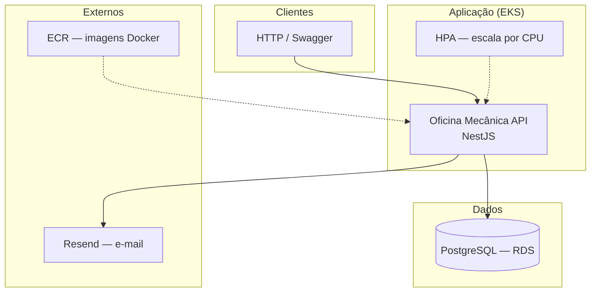
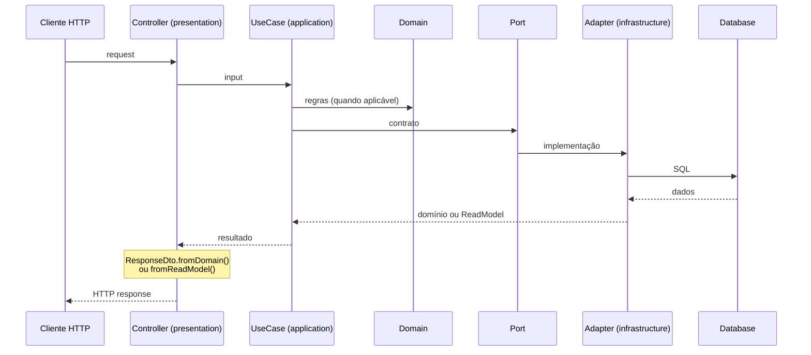
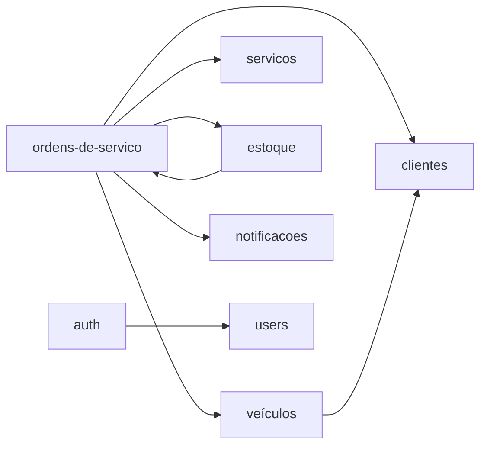

# Arquitetura

Documentação da arquitetura da **Oficina Mecânica API**: monólito modular em NestJS com **Clean Architecture / Hexagonal** (ports e adapters) e testes automatizados.

Stack da aplicação: **NestJS** · **TypeORM** · **PostgreSQL** · **JWT** · **Resend** (e-mail).

Infraestrutura e deploy (Docker, Kubernetes, Terraform, CI/CD): [docs/deployment](../deployment/README.md).

---

## Visão geral da solução




| Parte          | Papel                                                                                                        |
| -------------- | ------------------------------------------------------------------------------------------------------------ |
| **API**        | Monólito modular: clientes, veículos, serviços, estoque, ordens de serviço, auth, notificações               |
| **PostgreSQL** | Persistência relacional (integridade e transações ACID) — [ADR 001](../adr/001-escolha-do-banco-de-dados.md) |
| **Resend**     | E-mails em mudanças de status da OS — [ADR 002](../adr/002-envio-de-email-com-resend.md)                     |
| **EKS + HPA**  | Orquestração e escala automática sob carga                                                                   |
| **ECR**        | Registro das imagens publicadas pelo CI/CD                                                                   |
| **Terraform**  | Provisionamento da infra AWS (`infra/`)                                                                      |


Guias de infra e deploy: [Deploy](../deployment/README.md).

---

## Clean / Hexagonal no código

Cada contexto de negócio vive em `src/{modulo}/`, com camadas e **ports** (contratos). A aplicação não importa TypeORM nem Resend diretamente nos use cases — isso fica nos **adapters** da infrastructure.

### Padrão interno de cada módulo

Quase todos os contextos seguem o mesmo recorte:

```
{modulo}/
├── module.ts                    # Nest: imports infra + controllers + use cases
│
├── domain/                      # regras puras, entidades, VOs, erros
│   └── value-objects/           # (quando faz sentido)
│
├── application/
│   ├── dto/                     # inputs da aplicação
│   ├── read-models/             # (ordens-de-servico) projeções de query tipadas
│   ├── ports/                   # contratos (repository, transactional, lookup…)
│   ├── use-cases/               # orquestração
│   └── validators/              # (ordens-de-servico)
│
├── infrastructure/
│   ├── infra.module.ts          # wiring TypeORM + adapters + exports de ports
│   ├── typeorm/
│   │   ├── entity/
│   │   └── repository/
│   ├── mappers/                 # (ordens-de-servico) entity → read model
│   ├── transactional/           # leitura/escrita dentro de EntityManager (cross-módulo)
│   ├── lookup/                  # leitura cross-módulo fora de transação
│   ├── credential/              # (users — senha para auth)
│   ├── adapters/                # implementa ports definidos por outros módulos
│   ├── persistence/             # (OS — transação multi-agregado)
│   ├── events/                  # (OS — event emitter + listeners)
│   └── helpers/                 # (OS — loader de read model; estoque — mutação de domínio)
│
└── presentation/
    ├── controllers/
    ├── dto/                     # DTOs HTTP (class-validator, Swagger)
    ├── mappers/                 # HTTP request → application input
    └── guards/                  # (auth)
```

Dois níveis de wiring Nest por contexto:

| Arquivo | Função |
| ------- | ------ |
| `{modulo}/module.ts` | API: controllers + use cases |
| `{modulo}/infrastructure/infra.module.ts` | Persistência + adapters + exports de ports |

| Camada | Responsabilidade |
| ------ | ---------------- |
| **presentation** | HTTP, validação de request, Swagger, mapeamento de resposta (`fromDomain` / `fromReadModel`) |
| **application** | Casos de uso; depende só de **ports**; retorna domínio ou read model |
| **domain** | Regras de negócio isoladas do framework |
| **infrastructure** | Persistência, e-mail, JWT/bcrypt, listeners |

### Fluxo de uma request




Erros de aplicação/domínio (`NotFoundError`, `BadRequestError`, etc.) sobem sem `HttpException` do Nest; o `ApplicationExceptionFilter` traduz para HTTP.

---

## Componentes da aplicação (`src/`)

```
src/
├── common/              # erros, filters, bootstrap, segurança
├── config/              # env + validação Joi
├── database/            # TypeORM, migrations, seeds
├── health/
├── auth/ · users/
├── clientes/ · veiculos/
├── servicos/ · estoque/
├── notificacoes/        # port de e-mail + adapter Resend
└── ordens-de-servico/   # workflow da OS + consultas + histórico
```

Contexto = pasta + `module.ts`. É **um único deploy**, com fronteiras claras entre módulos.

### Ordens de serviço (núcleo)

- **Writes** transacionais (abertura, itens, estoque, status) via port + `EntityManager` compartilhado.
- **Reads** via **read models** (CQRS light): evita acoplar o domínio da OS aos demais bounded contexts.
- Mudança de status dispara evento; listeners persistem histórico e notificam por e-mail.

### Notificações (e-mail)

`NotificacaoPort` + `ResendNotificacaoAdapter`. O listener da OS reage a `StatusAlteradoEvent` (ex.: aguardando aprovação → cliente; recebida / aguardando serviço → mecânicos). Detalhes de configuração: [build — Resend](../build/README.md#e-mail-resend).

### Integração entre módulos (ports)

Use cases **não** importam repositórios de outro módulo. Cruzamentos usam ports. Há dois padrões principais conforme o **contexto de execução**:

| | Lookup | Transactional |
| --- | --- | --- |
| **Quando** | Leitura auxiliar **fora** de transação | Coordenação **dentro** de `runInTransaction` |
| **Acesso** | Repositório ou `Repository` do dono | `EntityManager` compartilhado |
| **Exemplos** | `ClienteLookupPort` (veículos), `VeiculoLookupPort` (query da OS) | `ClienteTransactionalPort`, `VeiculoTransactionalPort`, serviço e estoque na OS |

- **Clientes** expõem os dois: lookup valida documento (CPF/CNPJ); transactional resolve o id dentro da transação da OS.
- **Veículos** expõem os dois: lookup devolve snapshot (incl. soft-deleted); transactional valida placa + cliente ao abrir OS.
- Na **transação da OS**, cliente, veículo, serviço e estoque usam ports **transactional** — mesma unidade ACID.
- Na **query** da OS, enriquecimento de veículo soft-deleted usa `VeiculoLookupPort`.
- **Notificação** — port de e-mail desacoplada do provedor (`NotificacaoPort` → Resend).




---

## Testes

- Unitários e de módulo em `src/**/*.spec.ts` (camadas e fluxos críticos da OS).
- Specs de controller em `test/` (HTTP com use cases mockados).

A pipeline de CI executa `npm test` antes do build da imagem e do deploy — ver [CI/CD](../ci-cd/README.md).

---

## Decisões e referências


| Documento                                                       | Conteúdo                     |
| --------------------------------------------------------------- | ---------------------------- |
| [ADR 001 — PostgreSQL](../adr/001-escolha-do-banco-de-dados.md) | Por que banco relacional     |
| [ADR 002 — Resend](../adr/002-envio-de-email-com-resend.md)     | Envio de e-mail              |
| [README do projeto](../../README.md)                            | Visão geral e início rápido  |
| [Entrega](../entrega/README.md)                                 | Nossa entrega (repo, vídeo, docs) |


