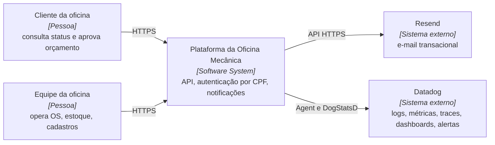
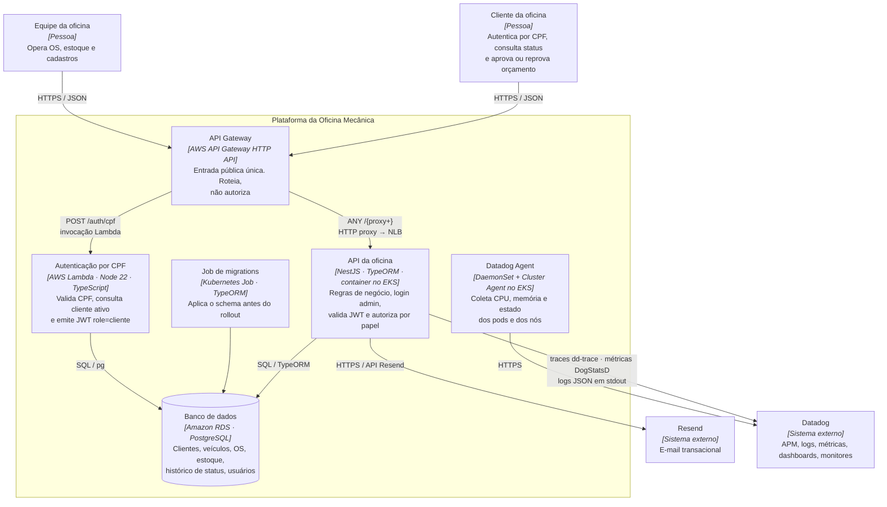
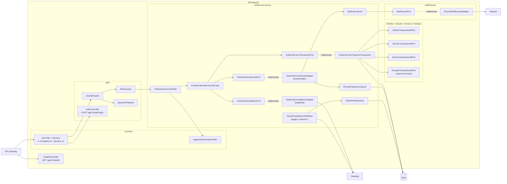
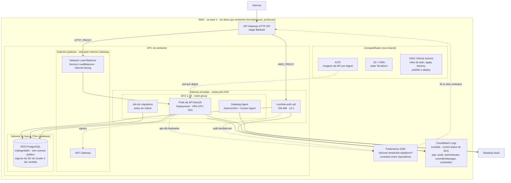
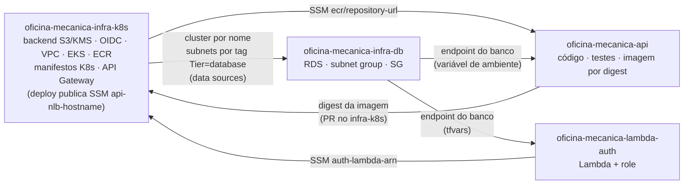

# 🧩 Diagrama de componentes

Visão de nuvem, APIs, banco e monitoramento da plataforma da oficina, organizada nos níveis do C4 Model: contexto, contêineres e componentes, mais o diagrama de implantação na AWS.

Detalhe interno da aplicação (módulos, ports, camadas): [architecture/README.md](./README.md). Integração e ordem de provisionamento entre os repositórios: [deployment/cross-repository.md](../deployment/cross-repository.md).

---

## 🌍 C1 · Contexto

Quem usa o sistema e com o que ele conversa.

Dois atores, dois sistemas externos. O Resend recebe os e-mails de mudança de status da OS ([ADR 002](../adr/002-envio-de-email-com-resend.md)). O Datadog recebe logs, traces e métricas de infraestrutura e de negócio ([ADR 006](../adr/006-stack-de-observabilidade.md)).

---

## 📦 C2 · Contêineres

Cada caixa é uma unidade executável ou de armazenamento com deploy próprio, com a tecnologia entre colchetes e a responsabilidade em uma linha. As setas trazem o protocolo. Onde cada contêiner roda (VPC, subnets, nós) está no [diagrama de implantação](#-implantação-na-aws).

### 🚪 Entrada

O API Gateway HTTP API é provisionado pelo módulo `api-gateway-http` do `oficina-mecanica-infra-k8s`, um por ambiente. Stage `$default` com auto deploy. Ele lê dois parâmetros SSM publicados por outros repositórios: o ARN da Lambda (`/oficina/<ambiente>/platform/auth-lambda-arn`, publicado pelo `lambda-auth`) e o hostname do NLB (`/oficina/<ambiente>/platform/api-nlb-hostname`, publicado pelo deploy Kubernetes).

| Rota | Integração | Destino |
| ---- | ---------- | ------- |
| `POST /auth/cpf` | `AWS_PROXY` | Lambda de autenticação |
| `ANY /{proxy+}` | `HTTP_PROXY`, `overwrite:path = $request.path` | NLB da API no EKS |

O proxy coringa evita cadastrar rota por endpoint. Todo o resto da API, incluindo o login administrativo e o Swagger em `/api`, passa por ele.

O Gateway não autoriza, só roteia. Assinatura e papel do token são verificados nos guards do Nest ([ADR 003](../adr/003-auth-cliente-lambda-jwt-role.md)).

### λ Function serverless

`aws_lambda_function.auth`: runtime `nodejs22.x`, handler `handler.handler`, 256 MB, timeout 10 s, empacotada como ZIP a partir de `dist/handler.js`. Recebe um CPF, valida o dígito verificador, confirma que existe cliente ativo e devolve um JWT com `role: "cliente"`. Não conhece regra de negócio da OS.

Acessa o Postgres com pool `pg` limitado a `max: 2`. Com `subnet_ids` informado, roda nas subnets privadas e alcança o RDS pela rede da VPC; o security group da Lambda entra no banco pela variável `extra_ingress_security_group_ids` do `infra-db`. O `terraform apply` publica o ARN no SSM para o Gateway.

Fluxo completo em [sequencia-auth.md](./sequencia-auth.md).

### ☸️ Aplicação no cluster

Monólito modular NestJS, containerizado, publicado no ECR por digest imutável e executado no EKS pelos manifestos canônicos de `oficina-mecanica-infra-k8s/kubernetes/oficina-api/`.

| Objeto | Configuração |
| ------ | ------------ |
| Deployment | `requests` 100m CPU / 256Mi · `limits` 500m CPU / 512Mi · securityContext sem root, `RuntimeDefault` |
| Probes | `startup`, `readiness` e `liveness` em `GET /api/v1/health` |
| Service | `LoadBalancer`, NLB `internet-facing` |
| HPA | `autoscaling/v2`, CPU 70%, até 3 réplicas ([ADR 005](../adr/005-uso-de-hpa.md)) |
| ConfigMap / Secret | Criados pelo pipeline a partir do GitHub Environment, nunca versionados |
| Job | Migrations TypeORM, aplicado e aguardado antes do rollout |

### 🗄️ Dados

RDS PostgreSQL provisionado por `oficina-mecanica-infra-db` nas subnets de tag `Tier = database`, descobertas por data source a partir do cluster ([ADR 007](../adr/007-terraform-do-banco-com-descoberta-via-data-sources.md)).

- `publicly_accessible = false`, `storage_encrypted = true`, backup de 7 dias, storage de 20 a 100 GiB
- Security group com ingress na porta do Postgres a partir do security group do cluster EKS e de SGs extras autorizados (Lambda)

Modelo relacional em [modelo-de-dados.md](./modelo-de-dados.md).

---

## 🔬 C3 · Componentes

Zoom no contêiner "API NestJS", limitado aos componentes que participam dos dois fluxos documentados nesta fase e da observabilidade. A decomposição completa por módulo está em [architecture/README.md](./README.md).

Papel de cada componente nos fluxos desta fase:

| Componente | Módulo | Papel nesta fase |
| ---------- | ------ | ---------------- |
| `JwtAuthGuard`, `RolesGuard`, `parseJwtPayload` | `auth` | Validam os dois formatos de JWT ([sequencia-auth.md](./sequencia-auth.md)) |
| `CreateOrdemServicoUseCase`, `OrdemServicoTransactionPort` | `ordens-de-servico` | Transação de abertura da OS ([sequencia-abertura-os.md](./sequencia-abertura-os.md)) |
| `OrdemServicoEventsAdapter` e listeners | `ordens-de-servico/infrastructure/events` | Histórico e e-mail ([ADR 004](../adr/004-padrao-de-comunicacao.md)) |
| `OrdemServicoMetricsAdapter` | `ordens-de-servico/infrastructure/adapters` | Métrica `oficina.ordem_servico.criada` após o commit |
| `TempoFaseMetricsPublisher`, `RelatorioRepository` | `ordens-de-servico/infrastructure/observability` | Gauge `oficina.ordem_servico.tempo_medio_fase` por fase, janela de 24 h |
| `configureApp` + `CoreModule` | `common` | Logger pino com `correlationId`, `redact` e injeção de `dd.trace_id` |
| `HealthController` | `health` | Probes do Kubernetes e health check do pipeline |

---

## ☁️ Implantação na AWS

Diagrama de implantação, complementar ao C4: onde cada contêiner do C2 roda na nuvem. Há dois ambientes, homologação e produção, cada um com VPC, cluster, Gateway, state Terraform e GitHub Environment próprios. O ECR e a identidade de publicação são compartilhados (root `shared`).

### 🌐 Rede

Provisionada pelo módulo `network` do `infra-k8s`, uma VPC por ambiente:

| Ambiente | CIDR | AZs | NAT | Node group |
| -------- | ---- | --- | --- | ---------- |
| homologação | `10.20.0.0/16` | 2 | um NAT Gateway | `t3.medium` SPOT, 1 a 3 nós |
| produção | `10.30.0.0/16` | 3 | um NAT por AZ | `m6i.large` on-demand, 2 a 6 nós |

Três camadas de subnet em cada uma:

| Camada | Rota padrão | Ocupantes |
| ------ | ----------- | --------- |
| Pública | Internet Gateway | NLB, NAT Gateway |
| Privada | NAT Gateway | Nós do EKS, Lambda, Datadog Agent |
| Database (`Tier = database`) | Nenhuma | RDS |

O RDS não tem caminho de saída nem de entrada pela internet. O isolamento vem da topologia, não só do security group.

### 🔐 Identidade e estado

- State Terraform em S3 com KMS, um por root (`shared`, `homologacao`, `producao`) e um para o banco (`oficina-mecanica/db/terraform.tfstate`).
- GitHub Actions autentica por OIDC com roles separadas para plan, apply, destroy, publicação de imagem e deploy Kubernetes. Não há access keys persistentes nos repositórios de plataforma.
- Segredos da aplicação (`POSTGRES_PASSWORD`, `JWT_SECRET`, `RESEND_API_KEY`) ficam nos GitHub Environments e viram Secret do Kubernetes na hora do deploy.

---

## 📡 Camada de monitoramento

Decidida na [RFC 004](../rfc/004-stack-de-observabilidade.md) e registrada na [ADR 006](../adr/006-stack-de-observabilidade.md). Operação detalhada em [datadog/README.md](../../datadog/README.md).

| Sinal | Origem | Como chega ao Datadog |
| ----- | ------ | --------------------- |
| Logs JSON da API com `correlationId`, `dd.trace_id` e `dd.span_id`, headers sensíveis redigidos | `nestjs-pino` + `pino-http` + `DD_LOGS_INJECTION` | stdout do container → Datadog Agent |
| Traces e latência por rota | `dd-trace` carregado antes do Nest (`--require dd-trace/init`) | Agent APM |
| Volume de OS | `oficina.ordem_servico.criada` (count), emitido após o commit | DogStatsD via Agent |
| Tempo médio por fase (diagnóstico, execução, finalização) | `oficina.ordem_servico.tempo_medio_fase` (gauge, tag `fase`, janela de 24 h), a cada 60 s | DogStatsD via Agent |
| CPU, memória e estado dos pods e nós | Datadog Agent (DaemonSet) + Cluster Agent, `kubernetes_state_core` | Helm chart `datadog/datadog` com `datadog/kubernetes-values.yaml` |
| Logs da Lambda e do control plane do EKS | CloudWatch Logs | CloudWatch |
| Healthcheck | `GET /api/v1/health`, probes e health check do pipeline | Kubernetes e `kubernetes-deploy.sh` |

Dashboard "Oficina Mecânica - Observabilidade" com volume de OS, tempo médio por fase, latência p95, requisições, erros 5xx e falhas de integração com o Resend; monitores de 5xx e de falha no Resend. Detalhes em [observability/README.md](../observability/README.md).

---

## 🚚 Entrega: repositórios, contratos e ordem de apply

Este diagrama não faz parte do C4. Mostra qual repositório provisiona o quê e como um repositório entrega ao outro o que ele precisa: por parâmetros SSM e por imagem no ECR, nunca por state compartilhado.

| Componente | Repositório | Pipeline |
| ---------- | ----------- | -------- |
| Backend S3/KMS, OIDC, VPC, EKS, ECR, API Gateway, manifestos K8s | `oficina-mecanica-infra-k8s` | PR: `terraform / gate` e `kubernetes / gate`. Merge em `homolog` → homologação, em `main` → produção. Deploy Kubernetes por digest com migration, rollout e health check |
| RDS, subnet group, security group | `oficina-mecanica-infra-db` | PR: `fmt` e `validate`. Push em `main`: `plan` e `apply` automático |
| Código, testes, imagem Docker | `oficina-mecanica-api` | PR para `homolog` ou `main`: `api / gate`. `publish-image.yml` publica imagem imutável `sha-<SHA>` no ECR por OIDC |
| Lambda, role de execução, ARN no SSM | `oficina-mecanica-lambda-auth` | PR e push em `main`: lint, testes unitários e de integração, `terraform validate` |

Ordem de provisionamento de um ambiente novo: bootstrap de backend e identidade → root `shared` → root do ambiente (rede, EKS, contratos) → banco → imagem da API → Lambda → deploy Kubernetes (publica o hostname do NLB) → API Gateway, depois que os dois parâmetros SSM existem. Procedimento completo em [cross-repository.md](../deployment/cross-repository.md) e nos runbooks do `infra-k8s`.

---

## 🔗 Relacionados

| Documento | Conteúdo |
| --------- | -------- |
| [Sequência: autenticação](./sequencia-auth.md) | Fluxo CPF e admin |
| [Sequência: abertura de OS](./sequencia-abertura-os.md) | Transação de criação |
| [Modelo de dados](./modelo-de-dados.md) | ER e relacionamentos |
| [Requisitos](./requisitos.md) | RF e RNF |
| [Observabilidade](../observability/README.md) | Dashboard, monitores, logs |
| [Integração entre repositórios](../deployment/cross-repository.md) | Ownership, SSM, ordem |
| [ADR 004](../adr/004-padrao-de-comunicacao.md) | Padrão de comunicação |
| [ADR 005](../adr/005-uso-de-hpa.md) | HPA |
| [ADR 006](../adr/006-stack-de-observabilidade.md) | Observabilidade |
| [ADR 007](../adr/007-terraform-do-banco-com-descoberta-via-data-sources.md) | Terraform do banco |
| [ADR 008](../adr/008-plataforma-por-ambiente-com-contratos-ssm.md) | Plataforma por ambiente e contratos SSM |
