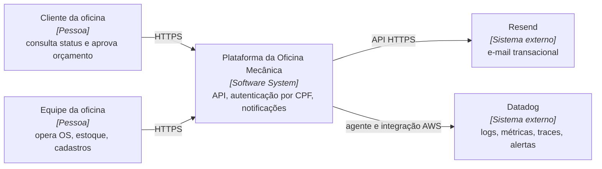
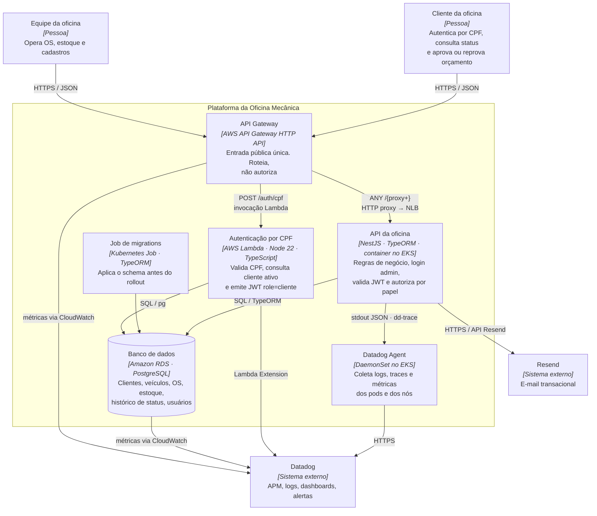
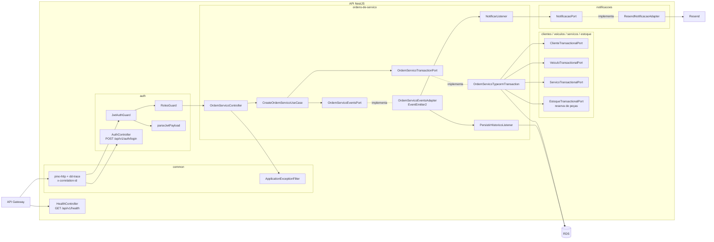
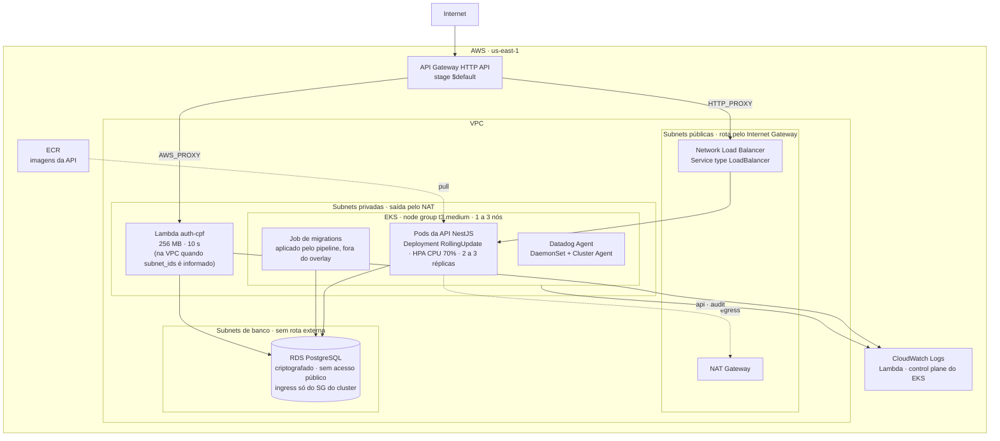
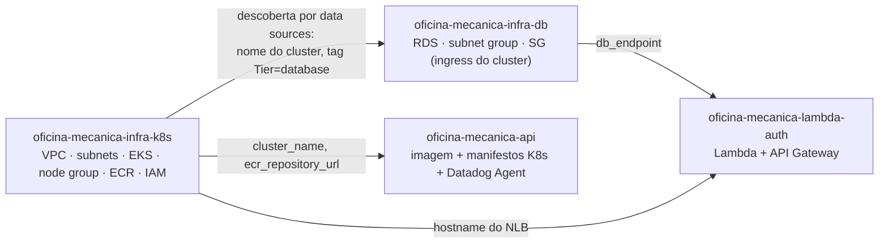

# 🧩 Diagrama de componentes

Visão de nuvem, APIs, banco e monitoramento da plataforma da oficina, organizada nos níveis do C4 Model: contexto, contêineres e componentes.

Detalhe interno da aplicação (módulos, ports, camadas): [architecture/README.md](./README.md). Guias de provisionamento: [deployment/](../deployment/README.md).

> Os diagramas mostram a arquitetura da Fase 3 como decidida nas RFCs e ADRs: Datadog como observabilidade ([ADR 006](../adr/006-stack-de-observabilidade.md)), Terraform separado por repositório ([RFC 005](../rfc/005-segregacao-de-repositorios.md)) e `RollingUpdate` com duas réplicas mínimas ([ADR 005](../adr/005-uso-de-hpa.md)). O que ainda está em implementação aparece na tabela de estado da seção de monitoramento, não nos desenhos.

---

## 🌍 C1 · Contexto

Quem usa o sistema e com o que ele conversa.

Dois atores, dois sistemas externos. O Resend recebe os e-mails de mudança de status da OS ([ADR 002](../adr/002-envio-de-email-com-resend.md)). O Datadog recebe telemetria de todos os componentes e é o único ponto onde a equipe olha para saber se a plataforma está saudável.

---

## 📦 C2 · Contêineres

Cada caixa é uma unidade executável ou de armazenamento com deploy próprio, com a tecnologia entre colchetes e a responsabilidade em uma linha. As setas trazem o protocolo. Onde cada contêiner roda (VPC, subnets, nós) está no [diagrama de implantação](#-implantação-na-aws).

## 🔬 C3 · Componentes

Zoom no contêiner "API NestJS", limitado aos componentes que participam dos dois fluxos documentados nesta fase. A decomposição completa por módulo está em [architecture/README.md](./README.md).

Papel de cada componente nos fluxos desta fase:

| Componente | Módulo | Papel nesta fase |
| ---------- | ------ | ---------------- |
| `JwtAuthGuard`, `RolesGuard`, `parseJwtPayload` | `auth` | Validam os dois formatos de JWT ([sequencia-auth.md](./sequencia-auth.md)) |
| `CreateOrdemServicoUseCase`, `OrdemServicoTransactionPort` | `ordens-de-servico` | Transação de abertura da OS ([sequencia-abertura-os.md](./sequencia-abertura-os.md)) |
| `OrdemServicoEventsAdapter` e listeners | `ordens-de-servico/infrastructure/events` | Histórico, e-mail e, pela ADR 006, métricas de negócio |
| `configureApp` + `CoreModule` | `common` | Logger pino e `x-correlation-id` |
| `HealthController` | `health` | Probes do Kubernetes e teste sintético |

---

## ☁️ Implantação na AWS

Diagrama de implantação, complementar ao C4: onde cada contêiner do C2 roda na nuvem. Provisionado por Terraform em `oficina-mecanica-infra-db` (banco) e `oficina-mecanica-infra-k8s` (rede, cluster, registro, IAM) — ver [ADR 007](../adr/007-terraform-do-banco-com-descoberta-via-data-sources.md).

### 🚪 Entrada

O API Gateway HTTP API é provisionado no repositório da Lambda (`aws_apigatewayv2_api.http`). Stage `$default` com `auto_deploy`, CORS aberto para qualquer origem.

| Rota | Integração | Destino |
| ---- | ---------- | ------- |
| `POST /auth/cpf` | `AWS_PROXY`, payload 2.0 | Lambda de autenticação |
| `ANY /{proxy+}` | `HTTP_PROXY`, timeout 29 s | NLB da API no EKS |

O proxy coringa evita cadastrar rota por endpoint. Todo o resto da API, incluindo o login administrativo, passa por ele.

O Gateway não autoriza, só roteia. Assinatura e papel do token são verificados nos guards do Nest ([ADR 003](../adr/003-auth-cliente-lambda-jwt-role.md)). Um token inválido só é recusado no final da cadeia, já dentro do cluster.

### λ Function serverless

`aws_lambda_function.auth`: runtime `nodejs22.x`, handler `handler.handler`, 256 MB, timeout 10 s, empacotada como ZIP a partir de `dist/handler.js`.

Recebe um CPF, valida o dígito verificador, confirma que existe cliente ativo e devolve um JWT com `role: "cliente"`. Não conhece regra de negócio da OS.

Acessa o Postgres com pool `pg` limitado a `max: 2`, porque cada execução atende uma requisição. O `vpc_config` é dinâmico: com `subnet_ids` preenchido a function roda dentro da VPC e alcança o RDS pela rede privada.

Fluxo completo em [sequencia-auth.md](./sequencia-auth.md).

### ☸️ Aplicação no cluster

Monólito modular NestJS, containerizado, publicado no ECR e executado no EKS.

| Objeto | Configuração |
| ------ | ------------ |
| Deployment | `requests` 100m CPU / 256Mi · `limits` 500m CPU / 512Mi · `RollingUpdate` com `maxUnavailable: 0` e `PodDisruptionBudget` ([ADR 005](../adr/005-uso-de-hpa.md)) |
| Probes | `startup` (até 180 s), `readiness` (15 s + 10 s), `liveness` (30 s + 20 s) |
| Service | `LoadBalancer`, provisiona o NLB |
| HPA | `autoscaling/v2`, CPU 70%, 2 a 3 réplicas ([ADR 005](../adr/005-uso-de-hpa.md)) |
| ConfigMap / Secret | Injetados via `envFrom` |
| Job | Migrations TypeORM, aplicado pelo pipeline após o `kubectl apply` do overlay |

Node group padrão: `t3.medium`, `desired 2`, `min 1`, `max 3`.

### 🗄️ Dados

RDS PostgreSQL em subnets dedicadas (`aws_subnet.database`), sem rota para a internet.

- `publicly_accessible = false`
- `storage_encrypted = true`
- Security group com um único ingress: a porta do Postgres, vinda do security group do cluster EKS

Por isso a Lambda só alcança o banco quando roda dentro da VPC com um security group aceito por essa regra.

Modelo relacional e ajustes propostos em [modelo-de-dados.md](./modelo-de-dados.md).

### 🌐 Rede

Três camadas de subnet, provisionadas junto com o cluster (destino: `oficina-mecanica-infra-k8s`); o repositório do banco as descobre pela tag `Tier` ([ADR 007](../adr/007-terraform-do-banco-com-descoberta-via-data-sources.md)):

| Camada | Rota padrão | Ocupantes |
| ------ | ----------- | --------- |
| Pública | Internet Gateway | NLB, NAT Gateway |
| Privada | NAT Gateway | Nós do EKS, Lambda em VPC, Datadog Agent |
| Database | Nenhuma | RDS |

O RDS não tem caminho de saída nem de entrada pela internet. O isolamento vem da topologia, não só do security group.

---

## 📡 Camada de monitoramento

Decidida na [RFC 004](../rfc/004-stack-de-observabilidade.md) e registrada na [ADR 006](../adr/006-stack-de-observabilidade.md). Estado em 11/09/2026:

| Sinal | Origem | Como chega ao Datadog | Estado |
| ----- | ------ | --------------------- | ------ |
| Logs JSON da API, com `correlationId` | `nestjs-pino` + `pino-http` no Nest | stdout do container → Datadog Agent (DaemonSet) | 🟡 log existe na branch `integration-datadog`; agente não |
| Logs JSON da Lambda, com `requestId` | `logStructured` em `src/infrastructure/logger.ts` | CloudWatch → integração AWS, ou Lambda Extension | ⏳ integração não configurada |
| Traces e latência por rota | `dd-trace` no Nest | Agent APM | ⏳ |
| CPU e memória de pods e nós | kubelet / cAdvisor | Datadog Agent | ⏳ |
| Healthcheck e uptime | `GET /api/v1/health` | Synthetic API Test do Datadog | ⏳ |
| Métricas de negócio (OS criadas, tempo por status) | Listeners de eventos da OS ([ADR 004](../adr/004-padrao-de-comunicacao.md)) | DogStatsD via Agent | ⏳ |
| Métricas do RDS e do Gateway | CloudWatch | Integração AWS | ⏳ |

O que falta para a correlação ser ponta a ponta: o Gateway precisa injetar `x-correlation-id` (ou o Nest precisa aceitar o `x-amzn-trace-id` que o Gateway já envia) e a Lambda precisa logar o mesmo valor. Hoje a Lambda loga o `requestId` do Gateway e o Nest gera um UUID próprio quando o header não vem. Os dois ids não se cruzam.

Detalhes operacionais (dashboards, monitores, campos de log): [observability/README.md](../observability/README.md).

---

## 🚚 Entrega: repositórios e alvos de deploy

Este diagrama não faz parte do C4. Mostra qual repositório provisiona o quê e em que ordem o `terraform apply` acontece, conforme a [RFC 005](../rfc/005-segregacao-de-repositorios.md).

| Componente | Repositório | Pipeline |
| ---------- | ----------- | -------- |
| RDS PostgreSQL, subnet group, security group | `oficina-mecanica-infra-db` | `fmt`/`validate` em PR, `plan` + `apply` automático em `main` ✅ |
| VPC, subnets, EKS, node group, ECR, IAM | `oficina-mecanica-infra-k8s` | `terraform plan` em PR, `apply` em `develop` e `main` (a migrar do repo da API) |
| Imagem, manifestos K8s, Datadog Agent | `oficina-mecanica-api` | `ci-cd.yml`: build, push no ECR, `kubectl apply`, migrations |
| Lambda + API Gateway | `oficina-mecanica-lambda-auth` | lint, testes, `terraform apply` |

O repositório do banco descobre a rede por data sources (nome do cluster e tags), sem ler state alheio; os demais consomem outputs via variáveis de pipeline. A ordem de apply é cluster antes de banco. Decisão e etapas: [RFC 005](../rfc/005-segregacao-de-repositorios.md); implementação do banco registrada na [ADR 007](../adr/007-terraform-do-banco-com-descoberta-via-data-sources.md).

---

## 🔗 Relacionados

| Documento | Conteúdo |
| --------- | -------- |
| [Sequência: autenticação](./sequencia-auth.md) | Fluxo CPF e admin |
| [Sequência: abertura de OS](./sequencia-abertura-os.md) | Transação de criação |
| [Modelo de dados](./modelo-de-dados.md) | ER e relacionamentos |
| [Observabilidade](../observability/README.md) | Dashboards, monitores, logs |
| [ADR 004](../adr/004-padrao-de-comunicacao.md) | Padrão de comunicação |
| [ADR 005](../adr/005-uso-de-hpa.md) | HPA |
| [ADR 006](../adr/006-stack-de-observabilidade.md) | Stack de observabilidade |
| [RFC 001](../rfc/001-escolha-da-nuvem.md) | Escolha da nuvem |
