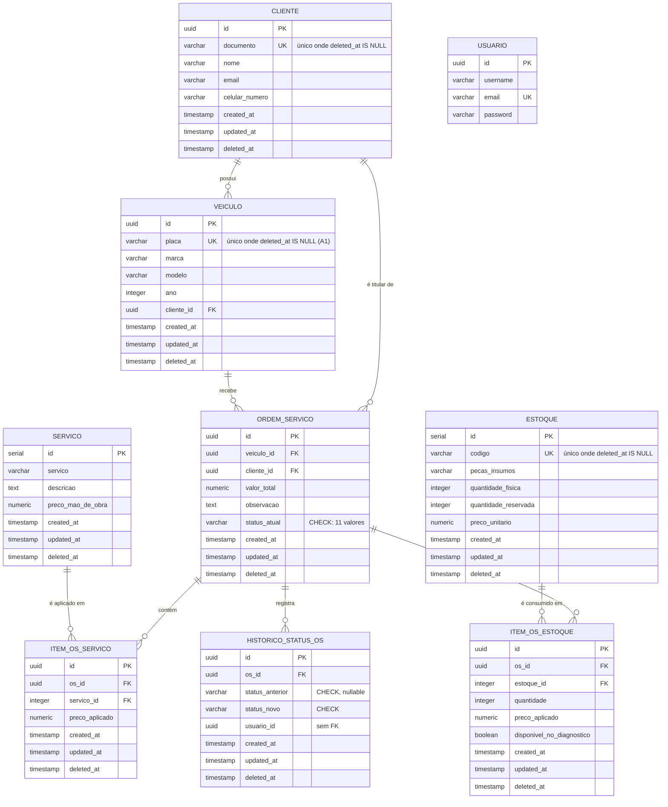

# 🗄️ Modelo de dados

Justificativa formal da escolha do banco, diagrama ER, explicação dos relacionamentos e ajustes propostos no modelo relacional.

Decisão de SGBD: [ADR 001 — Escolha do banco de dados](../adr/001-escolha-do-banco-de-dados.md). Decisão de banco **gerenciado** na AWS: [RFC 002](../rfc/002-banco-de-dados-gerenciado.md).

Fonte da verdade deste documento: as 14 migrations em `src/database/migrations/`.

---

## 📌 Justificativa formal da escolha

### Por que relacional

O domínio da oficina é uma malha de dependências, não um conjunto de agregados independentes. Um cliente possui veículos; uma ordem de serviço aponta para um veículo e um cliente; cada item da OS referencia um serviço do catálogo ou uma linha de estoque; cada transição de status precisa estar amarrada à OS correta. Isso é a definição de um modelo entidade-relacionamento.

Três propriedades do modelo relacional são exigidas pelo negócio:

| Propriedade | Onde o domínio exige |
| ----------- | -------------------- |
| **Integridade referencial** | Uma OS órfã (sem veículo) ou um item apontando para um serviço inexistente é um estado inválido. As oito FKs do schema tornam isso impossível no banco, não apenas na aplicação |
| **Transações ACID** | Abrir uma OS grava em `ordem_servico`, `item_os_servico`, `item_os_estoque` e `historico_status_os`, e ainda atualiza `estoque.quantidade_reservada`. Falha no meio não pode deixar peça reservada sem OS |
| **Restrições declarativas** | O `CHECK` de status e os índices únicos parciais impedem dados inconsistentes sem depender de duas rotas de código concordarem |

O caso da abertura de OS é o argumento mais forte. `CreateOrdemServicoUseCase` executa cinco operações dentro de um único `runInTransaction`, incluindo a reserva de peças. Sem atomicidade, uma falha após a reserva e antes da inserção da OS deixaria estoque bloqueado permanentemente, sem nenhum registro que explicasse por quê.

### Por que PostgreSQL

Tipagem adequada ao domínio (`uuid` nativo, `numeric(10,2)` para valores monetários sem erro de ponto flutuante, `TIMESTAMP(3)`), suporte a **índices únicos parciais** (usados no padrão de soft delete descrito adiante), maturidade no ecossistema Node/TypeORM e disponibilidade como serviço gerenciado.

### Por que gerenciado (Amazon RDS)

Detalhado na [RFC 002](../rfc/002-banco-de-dados-gerenciado.md). Resumo: o requisito de alta disponibilidade da Fase 3 exige backup automatizado, patching e failover. Operar Postgres em pod no EKS colocaria estado persistente no mesmo plano de escala do stateless, contradizendo o uso de HPA.

Configuração provisionada pelo Terraform de `oficina-mecanica-infra-db`:

| Parâmetro | Valor |
| --------- | ----- |
| Engine | `postgres` |
| Classe padrão | `db.t4g.micro` |
| Storage | 20 GB, autoescalável, `storage_encrypted = true` |
| Exposição | `publicly_accessible = false`, em subnets `database` |
| Rede | Security group aceita ingress **apenas** do security group do cluster EKS (SGs extras, ex.: Lambda em VPC, via variável `extra_ingress_security_group_ids`) |
| Multi-AZ | Variável `db_multi_az` (padrão `false`) |

---

## 🧭 Diagrama ER



`USUARIO` aparece sem aresta por decisão consciente. A justificativa está em [Identidade sem FK](#-identidade-sem-fk).

---

## 🔗 Explicação dos relacionamentos

### CLIENTE 1:N VEICULO

`veiculo.cliente_id` → `cliente.id`, `ON DELETE RESTRICT`, com índice `IDX_veiculo_cliente_id`.

Um cliente pode ter vários veículos; um veículo pertence a exatamente um cliente. `NOT NULL` no lado do veículo: não existe veículo sem dono no sistema. `RESTRICT` impede apagar um cliente que ainda tenha veículo, forçando o soft delete a ser o caminho de saída.

### CLIENTE 1:N ORDEM_SERVICO e VEICULO 1:N ORDEM_SERVICO

`ordem_servico` carrega **as duas** FKs, ambas `NOT NULL` e `RESTRICT`, ambas indexadas.

Isso é **desnormalização deliberada**. `cliente_id` é derivável por `ordem_servico → veiculo → cliente`, o que caracteriza dependência transitiva e, a rigor, viola 3FN. Foi mantido por duas razões:

1. Imutabilidade histórica. Um veículo pode ser transferido de dono. Se `cliente_id` fosse sempre derivado do veículo, uma OS de 2025 passaria a apontar para o comprador de 2026. A OS deve preservar quem era o cliente **no momento da abertura**.
2. Custo de consulta. As telas de listagem e os dashboards de volume filtram por cliente. Sem a coluna, toda consulta exigiria join adicional com `veiculo`.

O risco correspondente é divergência: nada no banco garante hoje que `ordem_servico.cliente_id` seja o dono do `ordem_servico.veiculo_id`. A garantia é aplicacional, em `tx.findVeiculoIdForCliente(placa, clienteId)`. Ver [proposta de ajuste A5](#a5--consistência-entre-cliente_id-e-veiculo_id-da-os).

### ORDEM_SERVICO 1:N ITEM_OS_SERVICO e 1:N ITEM_OS_ESTOQUE

Duas tabelas de itens em vez de uma tabela polimórfica, porque os atributos divergem:

| | `item_os_servico` | `item_os_estoque` |
| --- | --- | --- |
| Quantidade | Não aplicável | `quantidade` |
| Reserva | Não | Sim, afeta `estoque.quantidade_reservada` |
| Extra | — | `disponivel_no_diagnostico` |

Uma tabela única exigiria colunas nulas e um discriminador, perdendo as FKs tipadas para `servico` e `estoque`. A separação mantém integridade referencial real dos dois lados.

`preco_aplicado` existe nas duas: é **snapshot do preço no momento da inclusão**. Sem ele, reajustar `servico.preco_mao_de_obra` reescreveria o valor de ordens antigas. Esse é o mesmo princípio da desnormalização de `cliente_id`.

### SERVICO 1:N ITEM_OS_SERVICO e ESTOQUE 1:N ITEM_OS_ESTOQUE

`RESTRICT` nas duas. Impede remover do catálogo um serviço ou peça já usado em alguma OS. Combinado com soft delete, o item saído de catálogo permanece resolvível para leitura histórica.

Juntas, as duas tabelas de item formam o relacionamento N:N entre `ordem_servico` e os catálogos, com atributos próprios na associação.

### ORDEM_SERVICO 1:N HISTORICO_STATUS_OS

`historico_status_os` é tabela de auditoria append-only. Cada linha registra `status_anterior` (nulo na abertura) e `status_novo`.

`ordem_servico.status_atual` duplica a informação da última linha do histórico. É desnormalização de leitura: recuperar o status corrente sem subconsulta ordenada. Os três `CHECK` constraints garantem que as duas representações usem o mesmo vocabulário de 11 valores:

```
RECEBIDA · EM_DIAGNOSTICO · AGUARDANDO_APROVACAO · APROVADA
AGUARDANDO_SERVICO · AGUARDANDO_PECAS_INSUMOS · EM_EXECUCAO
FINALIZADA · ENTREGUE · REPROVADA · CANCELADA
```

### 🔐 Identidade sem FK

`historico_status_os.usuario_id` é `uuid` **nullable e sem chave estrangeira**. Guarda o claim `sub` do JWT, que pode vir de `usuario` (admin, via login Nest) ou de `cliente` (via Lambda de CPF).

A decisão está registrada em [ADR 003](../adr/003-auth-cliente-lambda-jwt-role.md). São duas tabelas de identidade distintas, e uma FK só poderia apontar para uma delas. As alternativas eram criar uma tabela `identidade` unificada ou duas colunas mutuamente exclusivas, ambas exigindo migration e backfill.

Consequência aceita: relatórios que precisem do nome do ator fazem `LEFT JOIN` nas duas tabelas e resolvem qual retornou. Ver [proposta de ajuste A4](#a4--coluna-ator_tipo-no-histórico).

### 🗑️ Soft delete

Oito das nove tabelas têm `deleted_at`. O padrão correto, aplicado em `cliente` e `estoque`, é índice único **parcial**:

```sql
CREATE UNIQUE INDEX "IDX_cliente_documento"
  ON "cliente" ("documento") WHERE "deleted_at" IS NULL;
```

Isso permite recadastrar um documento cujo registro anterior foi logicamente removido, sem abrir mão da unicidade entre os ativos. É recurso do PostgreSQL, e um dos motivos concretos da escolha do SGBD.

---

## 🔧 Ajustes propostos no modelo relacional

Sete pontos identificados na revisão do schema. A1 é defeito confirmado; os demais são melhorias.

### A1 — Índice parcial de `veiculo.placa` está inefetivo

**Severidade: alta. É um bug, não uma preferência de estilo.**

A migration `1745200000002-create-veiculo` cria a tabela com uma constraint de tabela:

```sql
CONSTRAINT "UQ_veiculo_placa" UNIQUE ("placa")
```

A migration `1777296910227-update-veiculo-placa-index` depois cria o índice parcial:

```sql
CREATE UNIQUE INDEX "IDX_veiculo_placa"
  ON "veiculo" ("placa") WHERE "deleted_at" IS NULL;
```

Mas **nunca remove `UQ_veiculo_placa`**. A constraint total continua ativa e prevalece: uma placa cujo veículo sofreu soft delete não pode ser recadastrada.

A comparação com `estoque` mostra que a equipe já conhece o procedimento correto. A migration `1777296910228-update-estoque-codigo-index` começa exatamente com o passo que falta em `veiculo`:

```sql
ALTER TABLE "estoque" DROP CONSTRAINT IF EXISTS "UQ_estoque_codigo";
```

**Correção proposta:**

```sql
ALTER TABLE "veiculo" DROP CONSTRAINT IF EXISTS "UQ_veiculo_placa";
```

Vale verificar em ambiente real antes de escrever a migration: se o índice `IDX_veiculo_placa` original tinha o mesmo nome da constraint, o `DROP INDEX IF EXISTS` pode ter se comportado de forma diferente do esperado. Confirmar com `\d veiculo` no psql antes de aplicar.

### A2 — Chaves primárias inconsistentes

Sete tabelas usam `uuid`; `servico` e `estoque` usam `SERIAL`. Não há critério de domínio que justifique a diferença.

Impacto prático: IDs sequenciais em catálogo são enumeráveis por quem tiver acesso à API, e a mistura obriga o código a lidar com `string` e `number` para o mesmo conceito de identificador (`item_os_servico.servico_id` é `integer`, `item_os_servico.os_id` é `uuid`).

Como a migração exigiria recriar FKs em `item_os_servico` e `item_os_estoque`, a recomendação é **documentar como dívida técnica consciente** nesta entrega, não migrar agora. Catálogos são tabelas pequenas e de baixa rotatividade, o que reduz o custo de conviver com a inconsistência.

### A3 — Tabela `usuario` fora do padrão

`usuario` é a única sem `created_at`, `updated_at` e `deleted_at`. Não há como saber quando um usuário administrativo foi criado, nem desativar um sem apagar a linha, o que colide com o `RESTRICT` do restante do schema.

```sql
ALTER TABLE "usuario"
  ADD COLUMN "created_at" TIMESTAMP(3) NOT NULL DEFAULT CURRENT_TIMESTAMP,
  ADD COLUMN "updated_at" TIMESTAMP(3),
  ADD COLUMN "deleted_at" TIMESTAMP(3);

ALTER TABLE "usuario" DROP CONSTRAINT IF EXISTS "UQ_415c35b9b3b6fe45a3b065030f5";

CREATE UNIQUE INDEX "IDX_usuario_email"
  ON "usuario" ("email") WHERE "deleted_at" IS NULL;
```

Note que o segundo passo é exatamente a lição de A1: trocar constraint total por índice parcial exige remover a constraint.

Os nomes de constraint gerados automaticamente pelo TypeORM (`UQ_415c...`, `PK_b54f...`) também destoam do padrão explícito do resto do schema. Vale renomear na mesma migration.

### A4 — Coluna `ator_tipo` no histórico

Torna explícito se `usuario_id` referencia admin ou cliente, sem exigir unificação de identidade:

```sql
ALTER TABLE "historico_status_os"
  ADD COLUMN "ator_tipo" character varying;

ALTER TABLE "historico_status_os"
  ADD CONSTRAINT "CHK_historico_ator_tipo"
  CHECK (ator_tipo IS NULL OR ator_tipo IN ('admin', 'cliente', 'sistema'));
```

O valor `sistema` cobre transições automáticas, como a de `TentarLiberarOsAposReposicaoEstoqueUseCase`, hoje gravadas com `usuario_id` nulo e indistinguíveis de uma ação sem autor identificado.

Já previsto como evolução na ADR 003.

### A5 — Consistência entre `cliente_id` e `veiculo_id` da OS

Nada no banco impede uma OS cujo `cliente_id` não seja o dono do `veiculo_id`. Hoje a garantia está apenas em `tx.findVeiculoIdForCliente`.

Chave estrangeira composta resolveria, mas exige `UNIQUE (id, cliente_id)` em `veiculo` (redundante, já que `id` é PK) e quebraria o caso de transferência de titularidade, que é justamente o motivo de a coluna existir.

**Recomendação: manter como está e documentar.** A invariante é "o cliente era o dono na abertura", que é temporal e não expressável por FK. Um teste de integração cobrindo a regra vale mais aqui do que uma constraint.

### A6 — Índices para os dashboards da Fase 3

Este é o ajuste que liga modelagem ao requisito de observabilidade. Os dashboards exigidos pelo enunciado disparam consultas que hoje fazem varredura sequencial.

| Dashboard exigido | Consulta | Índice hoje |
| ----------------- | -------- | ----------- |
| Volume diário de OS | `WHERE created_at BETWEEN ...` | Nenhum |
| Tempo médio por status | Janelas sobre `historico_status_os` ordenadas no tempo | Só `os_id` |
| OS por status | `WHERE status_atual = ...` | Nenhum |

```sql
CREATE INDEX "IDX_ordem_servico_created_at"
  ON "ordem_servico" ("created_at") WHERE "deleted_at" IS NULL;

CREATE INDEX "IDX_ordem_servico_status_atual"
  ON "ordem_servico" ("status_atual") WHERE "deleted_at" IS NULL;

CREATE INDEX "IDX_historico_status_os_os_id_created_at"
  ON "historico_status_os" ("os_id", "created_at");
```

O terceiro substitui `IDX_historico_status_os_os_id`, já que um índice composto atende consultas pelo prefixo. O índice antigo pode ser removido na mesma migration.

Prioridade alta: sem eles, o dashboard de tempo médio degrada proporcionalmente ao volume total do histórico, e o próprio monitoramento vira fonte de latência na API.

### A7 — Movimentação de estoque sem trilha

`estoque.quantidade_fisica` e `quantidade_reservada` são mutáveis, e a reserva acontece dentro da transação de abertura da OS (`buildItensPecaWithReserva`). Não existe registro de **quando** e **por qual OS** cada reserva ocorreu.

Divergência entre saldo e a soma de `item_os_estoque.quantidade` é hoje indiagnosticável, e o enunciado pede alerta para falhas no processamento de ordens de serviço. Uma tabela `movimentacao_estoque` (`estoque_id`, `os_id`, `tipo`, `quantidade`, `created_at`) daria auditoria e serviria de base para o alerta.

Escopo relevante, provavelmente além desta fase. Registrar como evolução prevista.

---

## 📋 Resumo dos ajustes

| # | Ajuste | Severidade | Recomendação para esta fase | Status |
| --- | ------ | ---------- | --------------------------- | ------ |
| A1 | `UQ_veiculo_placa` não removida | 🔴 Alta | Corrigir | ⏳ Pendente (confirmar com `\d veiculo`) |
| A2 | PKs `SERIAL` vs `uuid` | 🟡 Média | Documentar como dívida | 📝 Documentado |
| A3 | `usuario` sem timestamps | 🟡 Média | Corrigir | ⏳ Pendente |
| A4 | `ator_tipo` no histórico | 🟡 Média | Avaliar | 📝 Documentado |
| A5 | Consistência cliente/veículo na OS | 🟢 Baixa | Documentar | 📝 Documentado |
| A6 | Índices dos dashboards | 🔴 Alta | Corrigir | ⏳ Pendente ([ADR 006](../adr/006-stack-de-observabilidade.md) depende) |
| A7 | Trilha de movimentação de estoque | 🟢 Baixa | Evolução prevista | 📝 Documentado |

Atualizar a coluna **Status** na mesma PR que criar a migration correspondente.

---

## 🔗 Relacionados

| Documento | Conteúdo |
| --------- | -------- |
| [ADR 001](../adr/001-escolha-do-banco-de-dados.md) | Decisão pelo modelo relacional e PostgreSQL |
| [ADR 003](../adr/003-auth-cliente-lambda-jwt-role.md) | Identidade dupla e `usuario_id` sem FK |
| [RFC 002](../rfc/002-banco-de-dados-gerenciado.md) | Banco gerenciado na AWS |
| [Componentes](./componentes.md) | Onde o RDS fica na topologia |
| [Sequência — abertura de OS](./sequencia-abertura-os.md) | A transação que sustenta o modelo |
