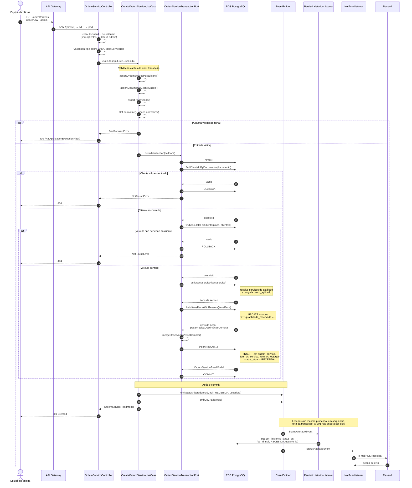
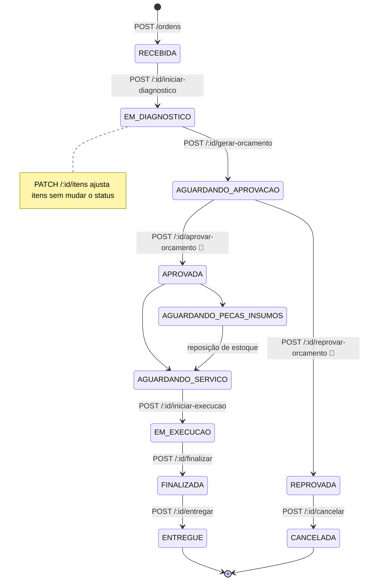

# 🔧 Diagrama de Sequência — Abertura de Ordem de Serviço

Fluxo de `POST /api/v1/ordens`, da requisição HTTP até a notificação por e-mail.

Implementação: `CreateOrdemServicoUseCase`. Modelo relacional envolvido: [modelo-de-dados.md](./modelo-de-dados.md).

---

## 🗺️ Fluxo completo



---

## 🔍 Leitura do fluxo

### Validação antes da transação

As três asserções e a normalização de CPF e placa acontecem **fora** de `runInTransaction`. Entrada malformada não abre transação nem toca no pool de conexões. É otimização deliberada: o erro mais frequente (dados inválidos no formulário) é também o mais barato de detectar.

### Uma transação, cinco operações

Tudo entre `BEGIN` e `COMMIT` compartilha o mesmo `EntityManager`, passado pelo `OrdemServicoTransactionPort`. O caso crítico é a ordem entre reserva e inserção:

```
buildItensPecaWithReserva  →  UPDATE estoque.quantidade_reservada
insertNewOs                →  INSERT ordem_servico + itens
```

A reserva ocorre **antes** da OS existir. Sem atomicidade, uma falha entre as duas deixaria estoque bloqueado sem nenhuma ordem que o justificasse, e sem trilha para diagnosticar. É a justificativa concreta do requisito ACID na [ADR 001](../adr/001-escolha-do-banco-de-dados.md), e o motivo pelo qual [A7 do modelo de dados](./modelo-de-dados.md#a7--movimentação-de-estoque-sem-trilha) propõe uma tabela de movimentação.

### Preço congelado no item

`buildItensServico` grava `preco_aplicado` em cada item. Reajuste posterior no catálogo não altera o valor de ordens já abertas. Mesmo princípio em `item_os_estoque`.

### Peça indisponível não bloqueia a abertura

`buildItensPecaWithReserva` devolve `pecaPrecisaObservacaoCompra`. Quando há peça sem saldo suficiente, `mergeObservacaoAvisoCompra` anexa um aviso ao campo `observacao` da OS, e a ordem é criada normalmente com status `RECEBIDA`.

A regra de negócio é que falta de peça vira informação para a oficina, não recusa ao cliente. O tratamento posterior fica com o status `AGUARDANDO_PECAS_INSUMOS` e com `TentarLiberarOsAposReposicaoEstoqueUseCase`.

### Eventos disparam antes do commit

`emitStatusAlterado` e `emitOsCriada` são chamados dentro do callback de `runInTransaction`, antes do `return os`, e o commit só acontece depois que o callback retorna. O `emit` do `EventEmitter2` é síncrono: cada listener começa a executar no momento da chamada. `PersistirHistoricoListener` grava com um `Repository` próprio, ou seja, em outra conexão do pool, fora da transação da OS. A promise do listener não é aguardada, então o HTTP 201 não espera pelo histórico nem pelo e-mail.

Isso cria uma corrida. O `INSERT` em `historico_status_os` tem chave estrangeira para `ordem_servico.id`. Se ele chegar ao banco antes do `COMMIT` da transação principal, a FK falha e o histórico não é gravado; se chegar depois, funciona. O resultado depende de qual conexão o Postgres atende primeiro.

Consequência a registrar: uma OS pode existir com `status_atual = RECEBIDA` e sem a linha correspondente em `historico_status_os`, seja pela corrida acima, seja por falha do listener. Não há retry nem dead-letter, e nada avisa. A correção é mover os dois `emit` para depois do `runInTransaction` (ou adotar o outbox da [ADR 004](../adr/004-padrao-de-comunicacao.md)); até lá, o monitor de histórico divergente da [ADR 006](../adr/006-stack-de-observabilidade.md) é o único sinal.

Esse é exatamente o caso que o enunciado da Fase 3 cobre ao pedir "alertas para falhas no processamento de ordens de serviço". É o primeiro alerta da stack de observabilidade ([ADR 006](../adr/006-stack-de-observabilidade.md)).

### `usuario_id` no histórico

O `sub` do JWT é repassado como `usuarioId` e gravado em `historico_status_os.usuario_id`, coluna `uuid` **sem FK**, que pode conter id de `usuario` ou de `cliente`. Justificativa na [ADR 003](../adr/003-auth-cliente-lambda-jwt-role.md); proposta de melhoria em [A4](./modelo-de-dados.md#a4--coluna-ator_tipo-no-histórico).

---

## 📊 Respostas possíveis

| Situação | HTTP | Origem |
| -------- | ---- | ------ |
| OS criada | 201 | Caminho feliz |
| Sem itens, CPF ou placa inválidos | 400 | Asserções do use case |
| DTO malformado | 400 | `ValidationPipe` |
| Token ausente ou inválido | 401 | `JwtAuthGuard` |
| Token de cliente | 403 | `RolesGuard`, default `['admin']` |
| Cliente ou veículo inexistente | 404 | Dentro da transação |
| Falha de banco | 500 | `ApplicationExceptionFilter` |

Erros de aplicação sobem como `NotFoundError`, `BadRequestError` e afins, sem `HttpException` do Nest. A tradução para HTTP é centralizada no filtro.

---

## 🔄 Ciclo de vida posterior

A abertura entrega a OS em `RECEBIDA`. As transições seguintes têm endpoints próprios:



👤 marca as duas rotas que exigem `@Roles('cliente')`. Todas as demais são administrativas. As transições válidas vêm de `transicoesValidas` em `domain/transicoes.ts`; `POST /:id/cancelar` só é aceito a partir de `REPROVADA`, e `POST /:id/avancar-status` aceita qualquer transição dessa tabela.

Os três status usados pelo dashboard de tempo médio exigido no enunciado (Diagnóstico, Execução, Finalização) correspondem a `EM_DIAGNOSTICO`, `EM_EXECUCAO` e `FINALIZADA`, e são calculáveis a partir dos `created_at` consecutivos em `historico_status_os`. Daí a proposta de índice composto em [A6](./modelo-de-dados.md#a6--índices-para-os-dashboards-da-fase-3).

---

## 🔗 Relacionados

| Documento | Conteúdo |
| --------- | -------- |
| [Sequência — autenticação](./sequencia-auth.md) | Como o token chega aqui |
| [Modelo de dados](./modelo-de-dados.md) | Tabelas escritas nesta transação |
| [ADR 004](../adr/004-padrao-de-comunicacao.md) | Ports, eventos e comunicação |
| [architecture/README.md](./README.md) | Camadas e ports |
