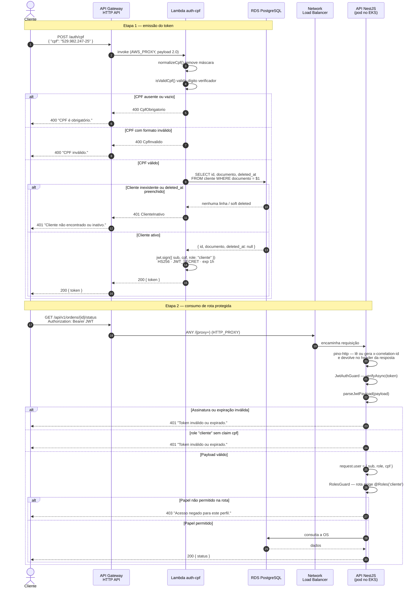
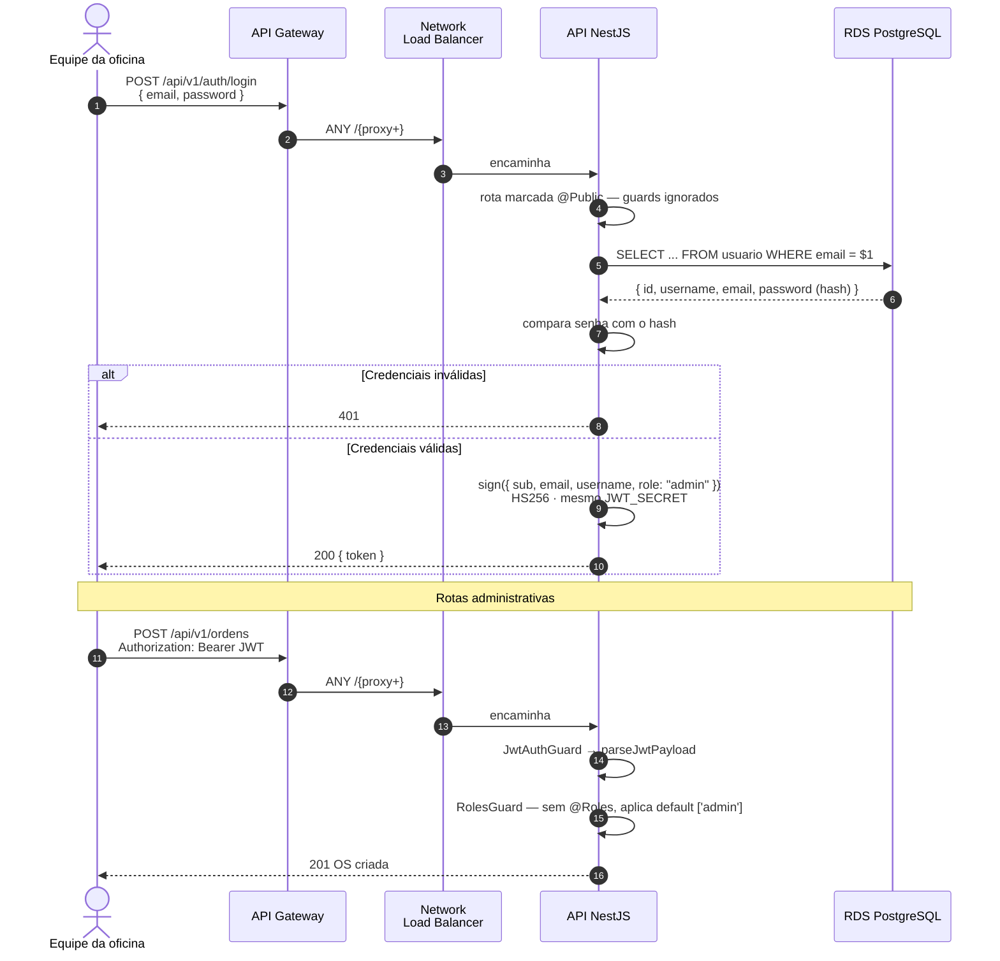

# 🔐 Diagrama de Sequência — Autenticação

Fluxo completo de autenticação nos dois perfis: cliente (CPF, via Lambda) e administrativo (e-mail e senha, via Nest).

Decisão que originou este desenho: [ADR 003](../adr/003-auth-cliente-lambda-jwt-role.md). Mapa de rotas por papel: [auth.md](./auth.md).

---

## 👤 Fluxo 1 — Cliente por CPF

Caminho feliz, do CPF ao consumo de uma rota protegida.

### Pontos de decisão

**Validação em três estágios.** Formato do CPF, existência do cliente e assinatura do token são verificados em momentos e componentes diferentes. Um CPF sintaticamente inválido nunca chega ao banco, o que evita consulta desnecessária no caminho de erro mais comum.

**A prova de identidade é a existência do cadastro.** Não há senha nem segundo fator neste fluxo. Quem conhece um CPF cadastrado obtém um token. É limitação assumida e documentada na ADR 003, adequada ao recorte acadêmico e inadequada a produção.

**`deleted_at` é verificado na aplicação, não na consulta.** O `SELECT` traz a coluna e `authenticateCpf` testa `cliente.deletedAt !== null`. Um `WHERE deleted_at IS NULL` no SQL aproveitaria o índice único parcial `IDX_cliente_documento`. Melhoria de baixo esforço.

**Falha de infraestrutura devolve 503.** Exceção não tratada no handler retorna `503 "Serviço temporariamente indisponível."` e emite log de nível `error` com o `requestId`. A mensagem interna não vaza para o cliente.

---

## 🛠️ Fluxo 2 — Administrativo por e-mail e senha

---

## 🧱 Contrato do token

Dois emissores, um único segredo HS256 compartilhado entre Lambda e Nest.

| Claim | Cliente | Admin |
| ----- | ------- | ----- |
| `sub` | `cliente.id` | `usuario.id` |
| `role` | `"cliente"` | `"admin"` |
| `cpf` | obrigatório | ausente |
| `email` | ausente | obrigatório |
| `username` | ausente | obrigatório |

`parseJwtPayload` implementa as regras de aceitação:

- `sub` ausente ou vazio → rejeita
- `role: "cliente"` sem `cpf` → rejeita
- `role` presente e diferente de `admin` ou `cliente` → rejeita
- `role` ausente, mas com `email` e `username` → aceita como `admin` (compatibilidade com tokens anteriores à ADR 003)

O `RolesGuard` é **fail-closed**: rota autenticada sem `@Roles` recebe o default `['admin']`. Um endpoint novo não fica acessível ao token de cliente por esquecimento.

---

## 🔒 Limitações conhecidas

Registradas aqui porque afetam a leitura do diagrama, e detalhadas na ADR 003.

| Limitação | Efeito |
| --------- | ------ |
| Segredo HS256 único | Quem tem o segredo emite tokens dos dois papéis. A separação entre emissores é operacional, não criptográfica |
| Sem `iss` / `aud` | Não há como distinguir criptograficamente qual emissor assinou |
| Sem filtro por dono | Qualquer cliente autenticado que descubra o UUID de uma OS acessa status e aprovação. É IDOR conhecido e aceito neste recorte |
| Gateway não autoriza | Token inválido só é recusado no Nest, após atravessar Gateway e NLB |
| Correlação | A Lambda loga o `requestId` do Gateway no CloudWatch. O Nest aceita `x-correlation-id` do cliente ou gera um UUID, devolve no header e injeta `dd.trace_id` nos logs. Os dois ids são consultáveis separadamente; a propagação do mesmo id pelo Gateway é evolução prevista na ADR 006 |

Detalhes de observabilidade na [ADR 006](../adr/006-stack-de-observabilidade.md).

---

## 🔗 Relacionados

| Documento | Conteúdo |
| --------- | -------- |
| [ADR 003](../adr/003-auth-cliente-lambda-jwt-role.md) | Decisão dos dois emissores |
| [RFC 003](../rfc/003-estrategia-de-autenticacao.md) | Alternativas avaliadas |
| [auth.md](./auth.md) | Rotas por papel |
| [Componentes](./componentes.md) | Gateway, Lambda e NLB na topologia |
| [Sequência — abertura de OS](./sequencia-abertura-os.md) | O que acontece depois do login |
