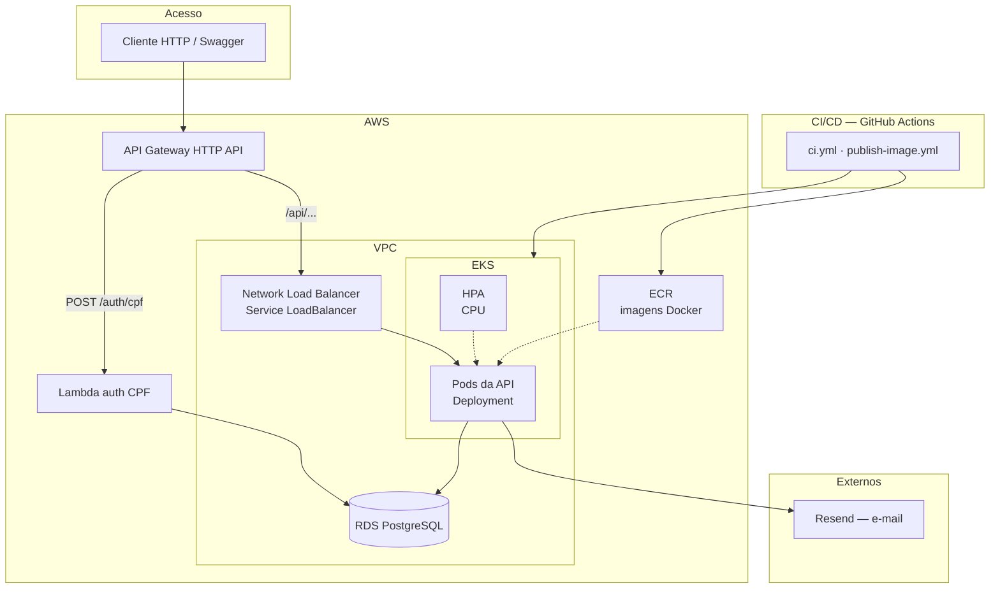
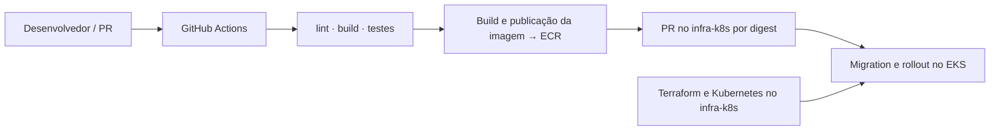

# ☁️ Deploy (AWS / Kubernetes)

Este índice orienta **onde** está cada guia de deploy e resume a infraestrutura provisionada.

## 🗺️ Desenho da arquitetura



Gateway e Lambda **não** estão neste repositório. A Lambda pertence a
[oficina-mecanica-lambda-auth](https://github.com/32SOAT/oficina-mecanica-lambda-auth)
e o API Gateway pertence a
[oficina-mecanica-infra-k8s](https://github.com/32SOAT/oficina-mecanica-infra-k8s).
O Nest é publicado como imagem e executado pelo deploy Kubernetes do
`infra-k8s`; a entrada pública é o endpoint padrão do API Gateway.

| Recurso | Função |
| ------- | ------ |
| 🌐 **VPC** + subnets | Rede gerenciada pelo `infra-k8s` |
| ☸️ **EKS** | Cluster Kubernetes gerenciado pelo `infra-k8s` |
| 📈 **HPA** | Escala pods conforme uso de CPU, aplicado pelo `infra-k8s` |
| 🗄️ **RDS PostgreSQL** | Banco gerenciado por seu repositório owner |
| 📦 **ECR** | Registro onde este repo publica imagens |
| 🔀 **NLB** | Entrada HTTP pública para a API no cluster; hostname publicado no SSM pelo `infra-k8s` |
| 🚪 **API Gateway** | HTTP API, `POST /auth/cpf` e proxy `/api` → Nest — gerenciado pelo `infra-k8s` |
| 🔐 **Lambda** | CPF → JWT — gerenciada pelo `oficina-mecanica-lambda-auth` |
| ✉️ **Resend** | E-mails de notificação da OS |
| ⚙️ **GitHub Actions** | Build, testes, push de imagem e apply no EKS |

---

## 🧭 Qual guia usar?

| Cenário | Onde ir | O que cobre |
| ------- | ------- | ----------- |
| 💻 **Desenvolvimento local** | [docs/build](../build/README.md) | npm, Docker Compose, migrations, testes, Resend |
| 🏗️ **Infraestrutura e integração AWS** | [cross-repository.md](./cross-repository.md) | Ownership, SSM, ordem e deploy entre os repositórios |
| 🎓 **AWS Academy** | [Integração entre repositórios](./cross-repository.md) | Pré-requisitos, ordem e handoff; operações AWS no `infra-k8s` |
| 🔐 **Auth cliente + Gateway** | [oficina-mecanica-lambda-auth](https://github.com/32SOAT/oficina-mecanica-lambda-auth) | Lambda CPF e proxy `/api` → Nest |
| ☸️ **Kubernetes local** (Minikube) | [k8s.md](./k8s.md) | Overlay Minikube, HPA e carga |
| ⚙️ **Pipeline CI/CD** | [docs/ci-cd](../ci-cd/README.md) | GitHub Actions |

## 🔄 Fluxo de deploy



Em resumo:

1. O banco e a plataforma são provisionados pelos repositórios owners.
2. Este repositório valida e publica a imagem imutável no ECR.
3. O `infra-k8s` referencia o digest, executa migration e faz o rollout no EKS.
4. O `infra-k8s` publica o hostname do NLB no SSM e aplica o API Gateway depois
   que a Lambda e o NLB estiverem disponíveis.

## 📁 Artefatos no repositório

| Artefato | Local |
| -------- | ----- |
| 🐳 Docker (app + Compose local) | `Dockerfile`, `docker-compose.yml` |
| ☸️ Kubernetes | `k8s/` |
| 📦 Publicação de imagem | `infra/publish-api-image.sh` |
| ⚙️ Pipeline | `.github/workflows/ci.yml`, `publish-image.yml` |

```text
oficina-mecanica-api/
├── Dockerfile
├── docker-compose.yml      # Dev local
├── infra/publish-api-image.sh # Publicação ECR
├── k8s/                    # Ambiente local / referência de aplicação
├── .github/workflows/
└── docs/deployment/
    ├── README.md                 # este índice
    ├── cross-repository.md       # Integração canônica entre repositórios
    ├── cross-repository.md        # Integração canônica entre repositórios
    └── k8s.md                    # Kubernetes local (Minikube)
```

Auth cliente (CPF): [oficina-mecanica-lambda-auth](https://github.com/32SOAT/oficina-mecanica-lambda-auth).
API Gateway, EKS e NLB: [oficina-mecanica-infra-k8s](https://github.com/32SOAT/oficina-mecanica-infra-k8s).

## 🔗 Relacionados

- 🧱 [Arquitetura da aplicação](../architecture/README.md)
- 🔐 [Autenticação](../architecture/auth.md)
- 💻 [Build local](../build/README.md)
- 📦 [Entrega](../entrega/README.md)
- 🔗 [Integração entre repositórios](./cross-repository.md)
