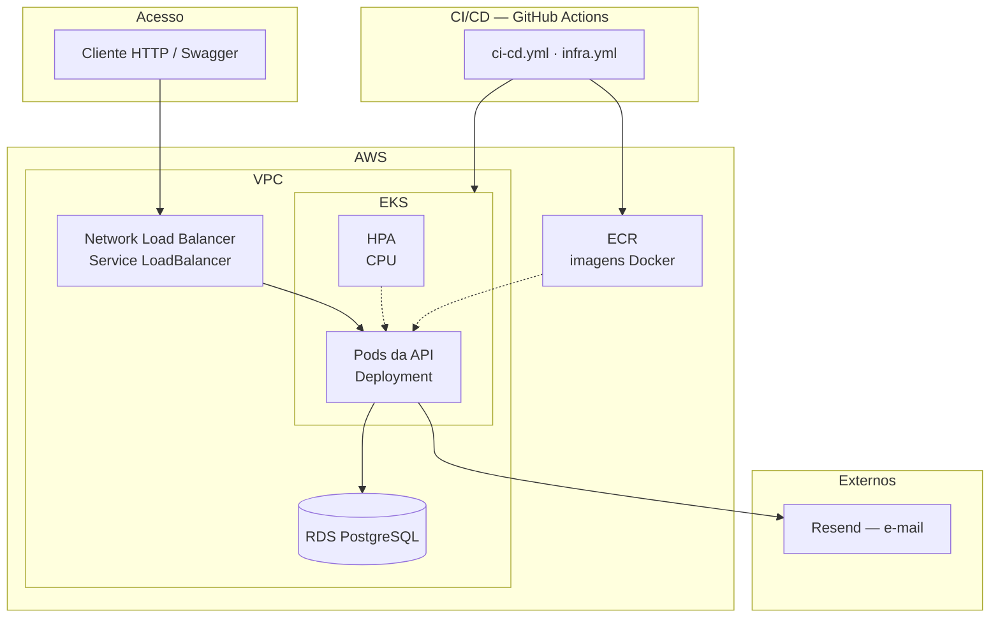
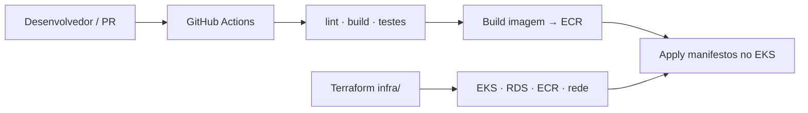

# ☁️ Deploy (AWS / Kubernetes)

Este índice orienta **onde** está cada guia de deploy e resume a infraestrutura provisionada.

## 🗺️ Desenho da arquitetura



| Recurso | Função |
| ------- | ------ |
| 🌐 **VPC** + subnets | Rede (pública, privada, database) — Terraform em `infra/` |
| ☸️ **EKS** | Cluster Kubernetes: Deployment, Service, ConfigMap/Secret |
| 📈 **HPA** | Escala pods conforme uso de CPU |
| 🗄️ **RDS PostgreSQL** | Banco gerenciado |
| 📦 **ECR** | Registro das imagens da API |
| 🔀 **NLB** | Entrada HTTP para a API no cluster |
| ✉️ **Resend** | E-mails de notificação da OS |
| ⚙️ **GitHub Actions** | Build, testes, push de imagem e apply no EKS |

---

## 🧭 Qual guia usar?

| Cenário | Onde ir | O que cobre |
| ------- | ------- | ----------- |
| 💻 **Desenvolvimento local** | [docs/build](../build/README.md) | npm, Docker Compose, migrations, testes, Resend |
| 🏗️ **Infraestrutura AWS** | [infra.md](./infra.md) | Terraform: EKS, RDS, ECR, rede |
| ☸️ **Kubernetes** (EKS e Minikube) | [k8s.md](./k8s.md) | Templates EKS, overlay Minikube, HPA e carga |
| ⚙️ **Pipeline CI/CD** | [docs/ci-cd](../ci-cd/README.md) | GitHub Actions |

## 🔄 Fluxo de deploy



Em resumo:

1. `infra/` → Terraform cria cluster, RDS, ECR, rede, etc.
2. `infra/` + `k8s/` → build/push da imagem + render do overlay Kubernetes
3. `k8s/` → `kubectl apply` (Deployment, Service, HPA, ConfigMap/Secret)
4. CI/CD → repete build/test/deploy em push ou disparo manual (`workflow_dispatch`)

## 📁 Artefatos no repositório

| Artefato | Local |
| -------- | ----- |
| 🐳 Docker (app + Compose local) | `Dockerfile`, `docker-compose.yml` |
| ☸️ Kubernetes | `k8s/` |
| 🏗️ Terraform | `infra/` |
| ⚙️ Pipeline | `.github/workflows/ci-cd.yml`, `infra.yml` |

```text
oficina-mecanica-api/
├── Dockerfile
├── docker-compose.yml      # Dev local
├── infra/                  # Código Terraform + scripts
├── k8s/                    # Templates / overlays (código)
├── .github/workflows/
└── docs/deployment/
    ├── README.md           # este índice
    ├── infra.md            # Deploy AWS (Terraform)
    └── k8s.md              # Kubernetes (EKS + Minikube)
```

## 🔗 Relacionados

- 🧱 [Arquitetura da aplicação](../architecture/README.md)
- 💻 [Build local](../build/README.md)
- 📦 [Entrega](../entrega/README.md)
