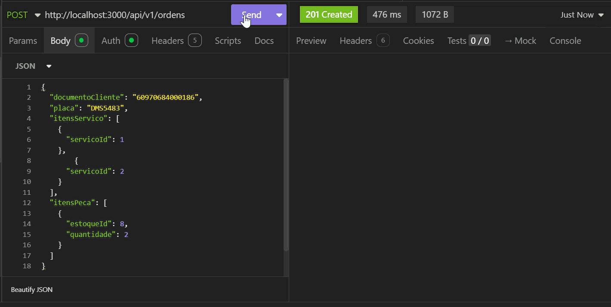
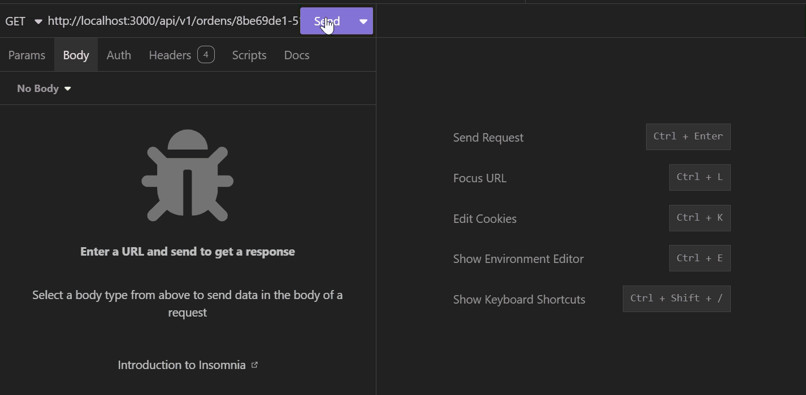
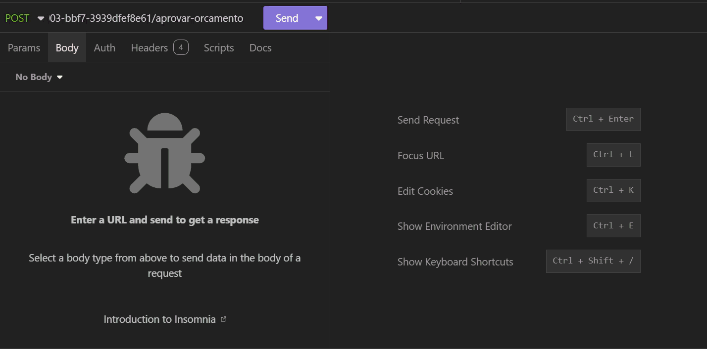

# 📦 Entrega

Artefatos e links da entrega. A seção da Fase 3 é a fonte do PDF único pedido no portal.

---

## 🎯 Fase 3

Preencher antes de gerar o PDF. Itens com ⏳ ainda não existem.

| Item do portal | Valor |
| -------------- | ----- |
| Repositório: aplicação | https://github.com/32SOAT/oficina-mecanica-api |
| Repositório: Lambda | https://github.com/32SOAT/oficina-mecanica-lambda-auth |
| Repositório: infra Kubernetes | https://github.com/32SOAT/oficina-mecanica-infra-k8s |
| Repositório: infra banco | https://github.com/32SOAT/oficina-mecanica-infra-db |
| Vídeo (até 15 min) | ⏳ roteiro em [observability/README.md](../observability/README.md#-roteiro-para-o-vídeo) |
| Documentação arquitetural | [docs/README.md](../README.md) |
| Diagrama de componentes | [componentes.md](../architecture/componentes.md) |
| Diagramas de sequência | [autenticação](../architecture/sequencia-auth.md), [abertura de OS](../architecture/sequencia-abertura-os.md) |
| RFCs | [docs/rfc](../rfc/README.md) |
| ADRs | [docs/adr](../adr/README.md) |
| Modelo de dados e justificativa do banco | [modelo-de-dados.md](../architecture/modelo-de-dados.md) |
| Swagger público | ⏳ `https://<gateway>/api` |
| Endpoint do API Gateway | ⏳ |
| Dashboards Datadog | ⏳ links dos 3 dashboards ([observability](../observability/README.md#-dashboards)) |
| `soat-architecture` adicionado aos 4 repositórios | ⏳ confirmar |

Checklist do vídeo (enunciado): autenticação com CPF, execução da pipeline, deploy automático, consumo das APIs protegidas, dashboard com análise ao vivo, logs e traces em execução.

---

## 📋 Fase 2 (histórico)

## 📋 Pedido no PDF do portal

| Item | Link / valor |
| ---- | ------------ |
| ☁️ **Desenho da arquitetura** (EKS, RDS, ECR, etc.) | [docs/deployment/README.md](../deployment/README.md) |
| 🧱 **Arquitetura da aplicação** | [docs/architecture/README.md](../architecture/README.md) |
| 🎬 **Vídeo demonstrativo** (YouTube) | https://www.youtube.com/watch?v=qgHBsH6hp6g |

### 📘 API (Swagger)

| Ambiente | URL |
| -------- | --- |
| 💻 Local | http://localhost:3000/api |

### 🛣️ Print demonstrativo das rotas

Prints / gravações da execução das principais rotas da API:

**Abertura da ordem de serviço** — `POST /api/v1/ordens` (`201 Created`):

**Consulta status da OS (cliente)** — `GET /api/v1/ordens/:id/status` (JWT `role: cliente`):

**Aprovação / reprovação do orçamento (cliente)** — `POST .../aprovar-orcamento` ou `POST .../reprovar-orcamento` (JWT `role: cliente`):

**Listagem de ordens de serviço** — `GET /api/v1/ordens` (filtro opcional `?status=ENTREGUE`):

### ✉️ Envio de e-mail (Resend)

Notificações reais com remetente `notificacoes@fiap.tech` ([configuração](../build/README.md)):

**Mecânicos** — ordem recebida (`RECEBIDA`):

**Mecânicos** — aguardando serviço (`AGUARDANDO_SERVICO`):

**Cliente** — orçamento aguardando aprovação:

**Cliente** — caixa de entrada (orçamento + serviço finalizado):

### 🧪 Print dos testes e análises

Cobertura de testes (`npm run test:cov`):

SonarQube (Overall Code) — Coverage: **91.0%** · Duplications: **0.0%** ([como rodar](../analysis/README.md)):

OWASP ZAP (DAST) — High: 0 · Medium: 0 · Low: 3 · Informational: 4 ([como rodar](../analysis/README.md)):

---

## ➕ Complemento

| Item | Link |
| ---- | ---- |
| 🔐 **Auth cliente (CPF) + API Gateway** | [oficina-mecanica-lambda-auth](https://github.com/32SOAT/oficina-mecanica-lambda-auth) · [auth.md](../architecture/auth.md) |
| 🧩 **Miro** — documentações adicionais (domain storytelling, event-driven) | https://miro.com/app/board/uXjVGupYixo=/?share_link_id=890608508965 |

---

## 📚 Onde está o restante

Índice completo da documentação: **[README do projeto](../../README.md)**.
