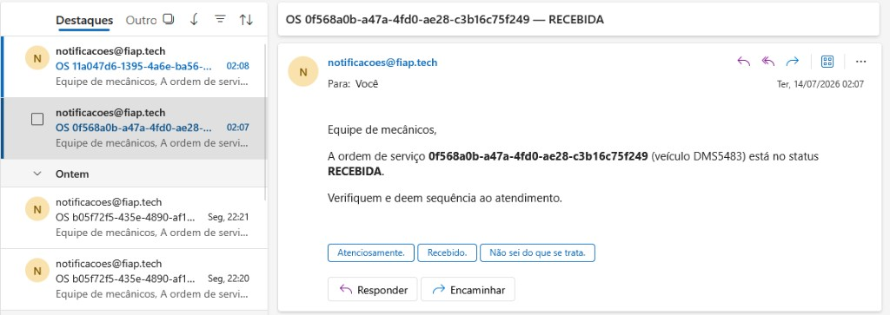
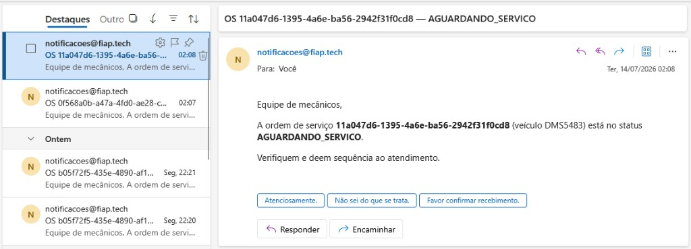
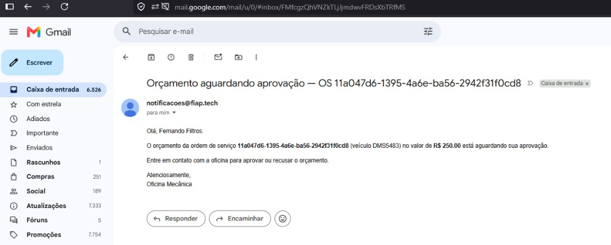
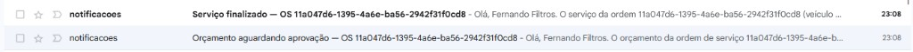
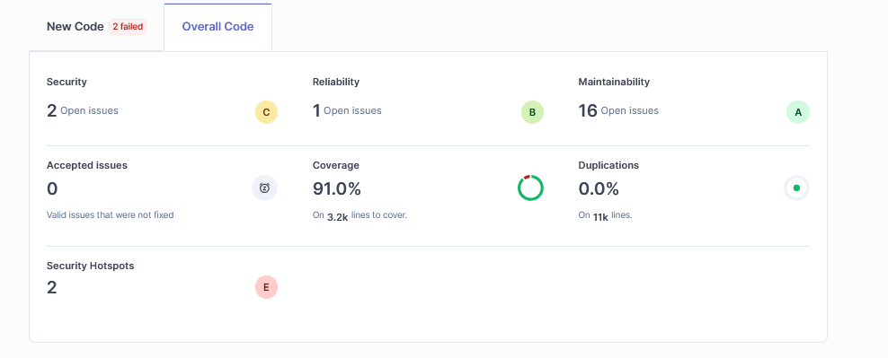
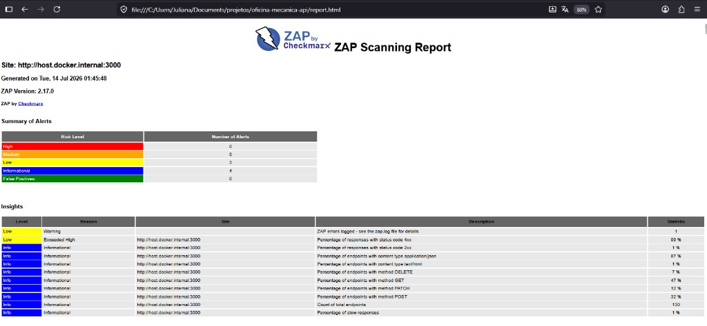

# 📦 Entrega

Artefatos e links da entrega.

---

## 📋 Pedido no PDF do portal

| Item | Link / valor |
| ---- | ------------ |
| ☁️ **Desenho da arquitetura** (EKS, RDS, ECR, etc.) | [docs/deployment/README.md](../deployment/README.md) |
| 🧱 **Arquitetura da aplicação** | [docs/architecture/README.md](../architecture/README.md) |
| 🎬 **Vídeo demonstrativo** (YouTube, até 15 min) | _cole o link do vídeo_ |

### 📘 API (Swagger)

| Ambiente | URL |
| -------- | --- |
| 💻 Local | http://localhost:3000/api |

### ✉️ Envio de e-mail (Resend)

Notificações reais com remetente `notificacoes@fiap.tech` ([configuração](../build/README.md)):

**Mecânicos** — ordem recebida (`RECEBIDA`):

**Mecânicos** — aguardando serviço (`AGUARDANDO_SERVICO`):

**Cliente** — orçamento aguardando aprovação (`R$ 250,00`):

**Cliente** — caixa de entrada (orçamento + serviço finalizado):

### 🧪 Print dos testes e análises

Cobertura de testes (`npm run test:cov`):

SonarQube (Overall Code) — Coverage: **91.0%** · Duplications: **0.0%** ([como rodar](../analysis/README.md)):

OWASP ZAP (DAST) — High: 0 · Medium: 0 · Low: 3 · Informational: 4 ([como rodar](../analysis/README.md)):

---

## ➕ Complemento

| Item | Link |
| ---- | ---- |
| 🧩 **Miro** — documentações adicionais (domain storytelling, event-driven) | https://miro.com/app/board/uXjVGupYixo=/?share_link_id=890608508965 |

---

## 📚 Onde está o restante

Índice completo da documentação: **[README do projeto](../../README.md)**.
