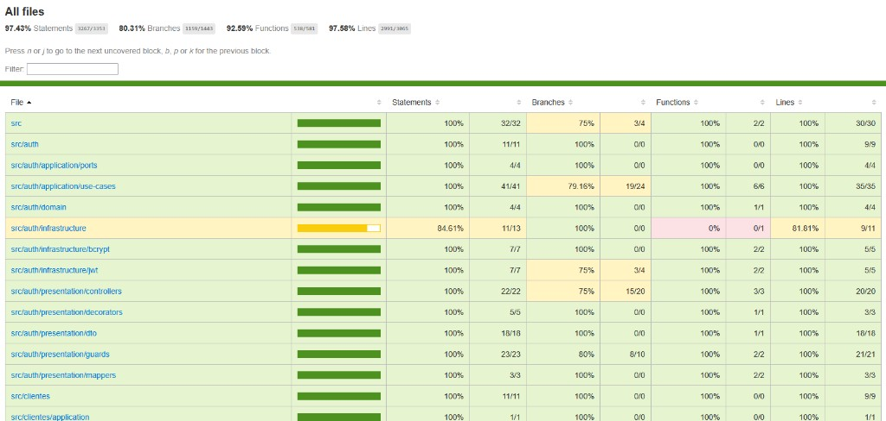

# Entrega

Links e artefatos da nossa entrega.

---

## Pedido no PDF do portal

| Item | Link / valor |
| ---- | ------------ |
| **Desenho da arquitetura** (recursos: EKS, RDS, ECR, etc.) | [docs/deployment/README.md](../deployment/README.md) |
| **Arquitetura da aplicação** (módulos / Clean Architecture) | [docs/architecture/README.md](../architecture/README.md) |
| **Vídeo demonstrativo** (YouTube, até 15 min) | _cole o link do vídeo_ |

### API (Swagger)

| Ambiente | URL |
| -------- | --- |
| Local | http://localhost:3000/api |

### Print dos testes e análises

Cobertura de testes (`npm run test:cov`):

---

## Complemento

| Item | Link |
| ---- | ---- |
| **Miro** — documentações adicionais (domain storytelling, event-driven) | https://miro.com/app/board/uXjVGupYixo=/?share_link_id=890608508965 |

---

## Documentação no repositório

| Tópico | Documento |
| ------ | --------- |
| Visão geral do projeto | [README.md](../../README.md) |
| Arquitetura | [docs/architecture/README.md](../architecture/README.md) |
| ADRs | [docs/adr/README.md](../adr/README.md) |
| Execução local | [docs/build/README.md](../build/README.md) |
| Deploy (índice) | [docs/deployment/README.md](../deployment/README.md) |
| Terraform / AWS | [docs/deployment/infra.md](../deployment/infra.md) |
| Kubernetes | [docs/deployment/k8s.md](../deployment/k8s.md) |
| CI/CD | [docs/ci-cd/README.md](../ci-cd/README.md) |

### Código e infra (no repo)

| Item | Caminho |
| ---- | ------- |
| Dockerfile / Compose | [`Dockerfile`](../../Dockerfile), [`docker-compose.yml`](../../docker-compose.yml) |
| Kubernetes | [`k8s/`](../../k8s/) |
| Terraform | [`infra/`](../../infra/) |
| Pipelines | [`.github/workflows/`](../../.github/workflows/) |
