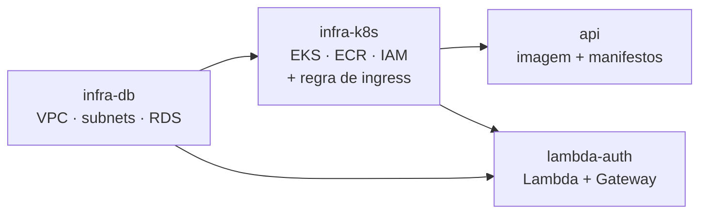

# RFC 005 — Segregação de repositórios

| Campo | Valor |
| ----- | ----- |
| Número | 005 |
| Data | 06/09/2026 |
| Status | ✅ Encerrada — Aprovada |
| Autores | Isaac Bruno Siqueira de Souza, Gustavo de Matos Parizi |
| Resultado | Alternativa B: migração completa, VPC em `infra-db`, regra de ingress em `infra-k8s` |

## 📄 Sumário

Proposta de migração do Terraform de cluster e de banco, hoje concentrado em `oficina-mecanica-api/infra/`, para os repositórios `oficina-mecanica-infra-k8s` e `oficina-mecanica-infra-db`, com pipeline de CI/CD próprio em cada um e contrato de dependência explícito entre eles.

## 📌 Motivação

O enunciado da fase exige quatro repositórios separados, cada um com CI/CD e deploy automático. A distribuição atual não corresponde.

**Estado verificado em 06/09/2026:**

| Repositório | Conteúdo | Deveria conter |
| ----------- | -------- | -------------- |
| `oficina-mecanica-api` | Aplicação NestJS **+ Terraform de VPC, EKS, ECR, IAM e RDS** | Somente a aplicação |
| `oficina-mecanica-lambda-auth` | Lambda + API Gateway | ✅ Correto |
| `oficina-mecanica-infra-k8s` | Apenas `LICENSE`. Sem README | Terraform do cluster |
| `oficina-mecanica-infra-db` | `LICENSE` + README de uma linha | Terraform do banco |

Dois dos quatro repositórios estão vazios. Os arquivos `infra/eks.tf`, `infra/network.tf`, `infra/ecr.tf`, `infra/iam.tf` e `infra/rds.tf` estão todos no repositório da aplicação.

Além do requisito formal, há três problemas práticos:

**Ciclos de vida acoplados.** A aplicação muda várias vezes por dia; a VPC muda raramente. Manter os dois no mesmo repositório significa que qualquer alteração de código dispara pipeline capaz de tocar infraestrutura.

**Blast radius.** Quem tem permissão de merge na aplicação tem, na prática, permissão para alterar a rede e o banco.

**State único.** Um único state do Terraform cobre rede, cluster, registro e banco. Um `terraform destroy` mal direcionado remove o RDS junto.

**Também há um requisito não atendido.** O enunciado pede deploy automático das branches de homologação e produção. Os quatro repositórios têm apenas `main` (o da aplicação tem também `feat/ci-cd`, `feat/config-infra` e `fix/adjusts-deploy`, nenhuma de ambiente).

## 📋 Requisitos

| # | Requisito |
| --- | --------- |
| R1 | Quatro repositórios, cada um com CI/CD funcional |
| R2 | `main` protegida, merge apenas por Pull Request |
| R3 | Deploy automático de homologação e produção |
| R4 | README com propósito, tecnologias, passos e diagrama próprio |
| R5 | Terraform de cluster em `infra-k8s` |
| R6 | Terraform de banco em `infra-db` |
| R7 | Usuário `soat-architecture` adicionado a todos |

## ⚖️ Critérios de avaliação

1. Conformidade com o enunciado
2. Risco de quebrar um deploy que hoje funciona
3. Esforço dentro do prazo restante
4. Clareza do contrato entre repositórios
5. Reprodutibilidade da demonstração em vídeo

O critério 2 pesa. Existe hoje um caminho de deploy que funciona ponta a ponta. Uma migração malfeita troca conformidade formal por uma demonstração que não roda.

## 🔀 Alternativas avaliadas

### A. Migração completa com state remoto compartilhado

Mover cada bloco de Terraform para seu repositório, com state separado, e usar `terraform_remote_state` para consumir saídas entre eles.

```
infra-db    →  VPC, subnets, RDS
                 outputs: vpc_id, subnet_ids, db_endpoint, db_sg_id

infra-k8s   →  EKS, node group, ECR, IAM
                 lê o remote state de infra-db
                 outputs: cluster_name, cluster_sg_id, ecr_url, nlb_hostname

api         →  imagem + manifestos
                 lê outputs de infra-k8s

lambda-auth →  Lambda + Gateway
                 lê db_endpoint de infra-db e nlb_hostname de infra-k8s
```

**A favor:** conformidade total, state isolado, ordem de dependência explícita.

**Contra:** exige backend remoto configurado (existe apenas como `backend.tf.example`), e há uma dependência circular a resolver. O security group do Postgres referencia hoje o SG do cluster EKS:

```hcl
security_groups = [aws_eks_cluster.this.vpc_config[0].cluster_security_group_id]
```

Se o RDS está em `infra-db` e o EKS em `infra-k8s`, a regra não pode ser criada com essa referência direta.

### B. Migração completa com quebra da dependência circular

Igual a A, mas com a regra de ingress extraída para um recurso separado, aplicado depois que ambos existem:

```hcl
# em infra-k8s, após o cluster existir
resource "aws_security_group_rule" "postgres_from_eks" {
  type                     = "ingress"
  from_port                = 5432
  to_port                  = 5432
  protocol                 = "tcp"
  security_group_id        = data.terraform_remote_state.db.outputs.db_security_group_id
  source_security_group_id = aws_eks_cluster.this.vpc_config[0].cluster_security_group_id
}
```

`aws_security_group_rule` como recurso independente é o padrão para esse tipo de referência cruzada. `infra-db` cria o SG vazio e exporta o id; `infra-k8s` adiciona a regra.

**A favor:** resolve o único bloqueio técnico real, mantendo o isolamento de rede intacto.

**Contra:** ordem de apply passa a importar (`infra-db` antes de `infra-k8s`), e precisa estar documentada.

### C. Migração parcial, apenas do RDS

Mover só `rds.tf` para `infra-db`, deixando VPC e EKS na aplicação.

Menor esforço, mas `infra-k8s` continuaria vazio, deixando R5 sem atender. Meio caminho que não fecha o requisito.

### D. Repositórios de infraestrutura como espelho

Manter o Terraform funcional na aplicação e copiar para os repositórios de infra apenas como documentação.

Rejeitada. Dois artefatos com a mesma função divergem, e o CI/CD exigido em R1 não teria o que executar de verdade.

### E. Monorepo com pastas

Contradiz o enunciado diretamente. Rejeitada.

## 📊 Comparação

| Critério | A | B | C | D | E |
| -------- | - | - | - | - | - |
| Conformidade | ✅ | ✅ | 🟡 | ❌ | ❌ |
| Risco de quebra | 🟡 | 🟡 | ✅ | ✅ | ✅ |
| Esforço | ❌ Alto | ❌ Alto | 🟡 | ✅ | ✅ |
| Contrato claro | 🟡 Circular | ✅ | 🟡 | ❌ | ❌ |

## ✅ Proposta

Adotar a **alternativa B**, em cinco etapas.

### Etapa 1 — Backend remoto

Configurar state em S3 com trava em DynamoDB, um par de chaves por repositório e por ambiente. Sem isso nada mais funciona, porque `terraform_remote_state` depende de state remoto acessível.

`infra/backend.tf.example` já existe como ponto de partida.

### Etapa 2 — `infra-db`

Mover `network.tf` e `rds.tf`. Criar o security group do Postgres **sem** a regra de ingress. Exportar `vpc_id`, `public_subnet_ids`, `private_subnet_ids`, `database_subnet_ids`, `db_endpoint`, `db_port`, `db_security_group_id`.

Decisão a tomar: a VPC pertence a `infra-db` ou a `infra-k8s`? A proposta é `infra-db`, porque o banco é o componente de ciclo de vida mais longo e o que menos deve ser recriado.

### Etapa 3 — `infra-k8s`

Mover `eks.tf`, `ecr.tf`, `iam.tf`, `locals.tf`, `versions.tf`. Ler o remote state de `infra-db` para as subnets. Adicionar `aws_security_group_rule.postgres_from_eks`. Exportar `cluster_name`, `cluster_endpoint`, `cluster_security_group_id`, `ecr_repository_url`.

### Etapa 4 — Limpar a aplicação

Remover `infra/`, mantendo `k8s/` e os scripts de render de overlay. Os scripts passam a ler outputs via `terraform_remote_state` de `infra-k8s` em vez de state local.

### Etapa 5 — Branches e proteção

Nos quatro repositórios:

- Criar a branch de homologação e manter `main` (produção)
- Proteger ambas: sem push direto, PR obrigatório, CI verde como requisito
- Pipeline: push em `develop` faz deploy de homologação; merge em `main` faz deploy de produção
- Adicionar `soat-architecture` como colaborador

### Ordem de execução



`lambda-auth` depende dos dois: precisa do endpoint do banco e do hostname do NLB para o proxy.

## ❓ Questões em aberto

| Questão | Encaminhamento |
| ------- | -------------- |
| Prazo comporta a migração? | Se não, entregar A1 e A3 do [modelo de dados](../architecture/modelo-de-dados.md) e documentar a divergência de forma explícita, em vez de migrar pela metade |
| VPC em `infra-db` ou `infra-k8s`? | Proposta: `infra-db`. Alternativa seria um quinto repositório de rede, que o enunciado não prevê |
| Como o pipeline da aplicação obtém credencial do cluster? | OIDC do GitHub Actions para role da AWS, evitando chave estática |
| Migrar o state existente ou recriar? | `terraform state mv` entre backends é possível, mas arriscado. Em ambiente de laboratório, recriar tende a ser mais previsível |
| Homologação e produção compartilham VPC? | Separar dá isolamento real e dobra custo. Decidir antes da etapa 1 |
| Sessão do AWS Academy expira | Documentar o procedimento de renovação de credencial nos quatro READMEs |

## ⚠️ Recomendação sobre o prazo

Se a migração não couber no prazo, a alternativa honesta não é deixar dois repositórios vazios. É preencher `infra-k8s` e `infra-db` com README que declare, de forma explícita, onde o Terraform reside hoje, por que a divisão não foi concluída e qual é o plano.

Um repositório com apenas `LICENSE` parece esquecimento. Um repositório com uma divergência documentada e um plano é uma decisão de engenharia sob restrição de tempo, que é exatamente o que uma RFC serve para registrar.

## 🏁 Resultado

**Encerrada — Aprovada.** O grupo decidiu migrar. A implementação seguiu a alternativa B com dois ajustes, registrados em ADRs próprias:

- `oficina-mecanica-infra-db` (Gustavo de Matos Parizi) contém só os recursos do banco e descobre a rede do cluster por data sources, sem `terraform_remote_state`. O security group do Postgres nasce com a regra de ingress. [ADR 007](../adr/007-terraform-do-banco-com-descoberta-via-data-sources.md).
- `oficina-mecanica-infra-k8s` (Isaac Bruno Siqueira de Souza) contém rede, EKS, ECR, identidades OIDC, manifestos Kubernetes e o API Gateway, em três roots com state próprio (`shared`, `homologacao`, `producao`). Os repositórios trocam valores por parâmetros SSM; a aplicação é promovida por digest imutável. Branches de ambiente são `homolog` e `main`. [ADR 008](../adr/008-plataforma-por-ambiente-com-contratos-ssm.md).

A dependência circular apontada na motivação deixou de existir: o banco depende do cluster, e só nessa direção. O repositório da API publica a imagem no ECR; o deploy é feito pelo `infra-k8s`.

## 🔗 Relacionados

- [RFC 001 — Escolha da nuvem](./001-escolha-da-nuvem.md)
- [RFC 002 — Banco de dados gerenciado](./002-banco-de-dados-gerenciado.md)
- [Componentes](../architecture/componentes.md)
- [CI/CD](../ci-cd/README.md)
